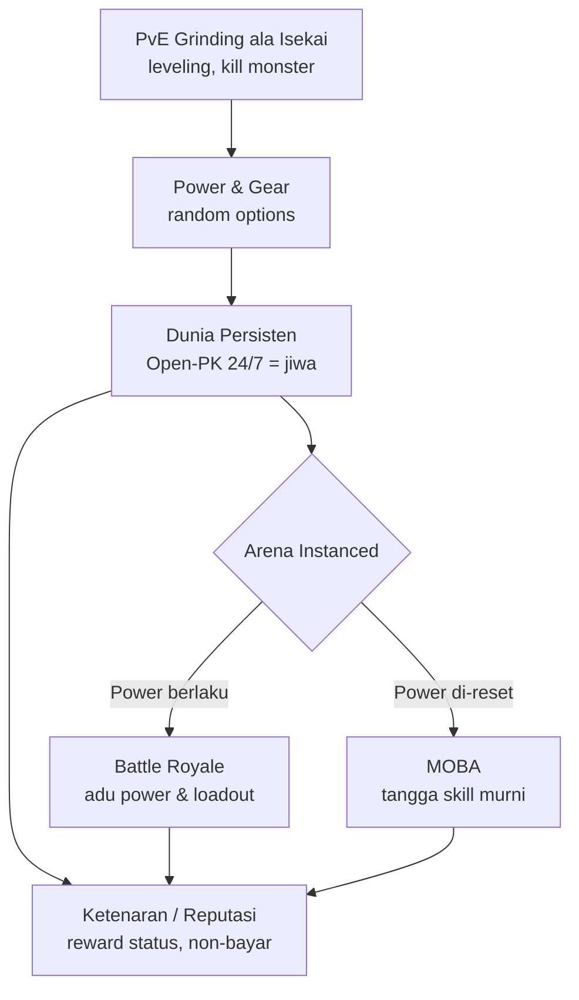
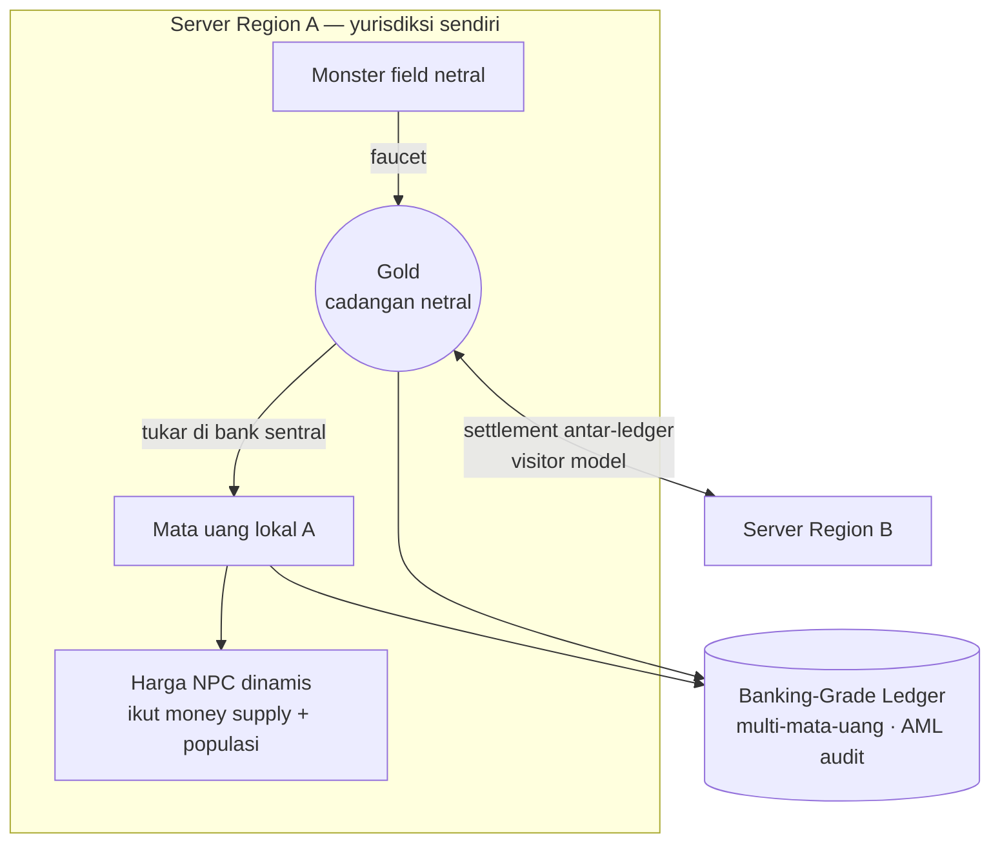
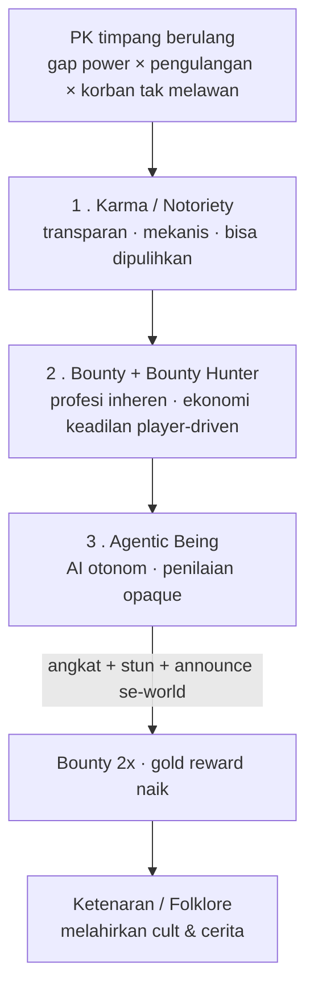

# Pilar Desain — Ran Online (Reimagining)

> **Status dokumen**: Hasil kristalisasi sesi brainstorming desain (2026-06-13). Sebagian sudah berupa keputusan, sebagian masih *leaning*/terbuka — lihat [§8 Status Keputusan](#8-status-keputusan). Dokumen ini adalah **north-star desain** untuk menghidupkan kembali Ran Online; dokumen arsitektur legacy (`01`–`05`, `adr/`, `future_enhancements/`) bersifat melengkapi.

Dokumen ini bukan ADR teknis. Ia memetakan **kenapa** dan **jiwa** dari proyek: prinsip utama, konsep game, sistem ekonomi, monetisasi, dan tata kelola konflik. Proyek ini sekaligus menjadi **wahana belajar Enterprise Architecture** — menggunakan sistem nyata yang kompleks untuk melatih visi, prinsip, ADR, dan tata kelola.

---

## 1. Prinsip Utama (Hard Principles)

Lima prinsip non-negotiable yang menjadi penjaga setiap keputusan:

1. **Tanpa gacha, tanpa judi.** Monetisasi & progresi tidak boleh bergantung pada mekanik untung-untungan.
2. **Ekonomi dinamis mengikuti indeks pasar.** Ekonomi mengatur diri sendiri lewat *price discovery*, bukan harga tetap atau keacakan loot-box, agar stabil dan adil.
3. **Hormati waktu pemain — ini game, bukan pekerjaan kedua.** Sesi bermakna yang berbatas; utamakan *sustainability* di atas maksimalisasi *engagement*. **BDO adalah anti-pattern** (komunitas besar tapi terasa hampa, hidup seperti kerja, hanya menghasilkan dopamine).
4. **Monetisasi untuk bertahan, bukan memaksimalkan profit.** Tujuan mencari uang = menjaga server tetap jalan tanpa merogoh kantong pribadi (*break-even*). Tuasnya: **biaya bangun & operasional yang rendah**. OpEx rendah menurunkan ambang impas — dan itulah yang **membebaskan proyek dari monetisasi predatoris dan tekanan luar**. *Efisiensi arsitektur = kemerdekaan etis.*
5. **Jaga chaos — bahaya & konflik adalah jiwa, bukan bug.** PK, risiko, bahkan *bully* adalah fitur. Dunia mati bukan karena bahaya, tapi karena **over-regulasi**: pengelola menumpuk aturan manual (mis. mem-ban pemain yang nge-PK saat jam PK) sampai mengikis konsekuensi & taruhan, hingga jadi "kubuRAN" — kuburan karakter *soulless* yang grinding pakai macro tanpa manusia. **Govern the economy hard, govern the playground light.**

> **Wawasan pemersatu**: *engagement-treadmill* ala BDO (prinsip 3) dan over-regulasi ala Ran lama (prinsip 5) sama-sama membunuh jiwa dari dua arah berlawanan. Musuh sebenarnya adalah **sterilitas / hilangnya taruhan nyata.** "Player-positive" berarti monetisasi yang tidak eksploitatif — **bukan** dunia yang aman dan tanpa friksi.

---

## 2. Platform & Target Pasar

* **Condong ke mobile.** Jangkauan PC makin menyempit; mobile = aksesibilitas lebih luas + sesi pendek yang menghormati waktu (prinsip 3).
* **Pasar SEA/Indonesia.** Genre mobile MOBA (Mobile Legends, AoV, Honor of Kings) dan Battle Royale (Free Fire, PUBGM) mendominasi. Free Fire membuktikan **jangkauan ponsel kelas bawah** penting — selaras dengan etos OpEx rendah.
* **Konsekuensi**: ini sebuah **reimagining**, bukan remake setia. Identitas Ran *diterjemahkan* ke ritme mobile, bukan disalin. Mobile juga **kandang gacha** — justru di sinilah garis anti-judi harus dipegang paling kuat.

---

## 3. Konsep Game (Core Loop)

* **Grinding tetap dipertahankan** — leveling dengan membunuh monster ala isekai.
* **Dunia persisten + Open-PK 24/7** adalah panggung adu power, hasil grinding, dan **ketenaran** bagi pemain yang berdedikasi. Bahaya & rasa takut (terpaksa istirahat di kampus) adalah tekstur yang disengaja.
* **Arena 2 mode**:
  * **Battle Royale** — power luar (gear/level) **berlaku**; identitas "adu power", dedikasi terbayar.
  * **MOBA** — power **di-reset/normalisasi**; tangga skill murni yang adil.
  * Membelah berdasarkan "apakah power luar berlaku" melayani dua tipe pemain sekaligus dan menjaga identitas genre.
* **Faksi = 3 sekolah** (Sacred Gate, Mystic Peak, Phoenix). Tidak lagi memegang mata uang sendiri; perannya kini menjadi **tim/faksi di arena** + sumber rivalitas Open-PK.
* **Ketenaran** adalah hadiah status **non-bayar** (didapat lewat skill + dedikasi) — penegak prinsip no-pay-to-win.

---

## 4. Sistem Ekonomi

* **Sumbu mata uang = server region** (bukan faksi). Tiap region punya **satu mata uang lokal + Gold**.
* **Gold = jangkar/cadangan universal.** Dijatuhkan monster di field netral luar kampus (tempat grinding asli; monster kampus hanya level kecil). Gold adalah **satu-satunya aset yang menyeberang region**.
* **Mata uang lokal** untuk pemakaian domestik (harga NPC, pajak, layanan). Didapat dengan menukar Gold di loket bank sentral region. **Harga NPC dinamis** mengikuti money supply lokal; **populasi menggerakkan inflasi** per-region (makin banyak warga → makin banyak Gold dibawa pulang → makin banyak mata uang lokal diterbitkan → harga naik).
* **Konvertibilitas Gold ↔ lokal = mengambang (float)** — konsisten dengan prinsip "ekonomi ikut indeks pasar".
* **Lintas region = berkunjung, bukan pindah** (patuh data residency POJK 11/2022): wallet & data tetap di region asal. Bawa **Gold**; region asal mendebet → pesan settlement → region tujuan kredit saldo Gold-kunjungan → tukar ke mata uang lokal di sana. Dua ledger berdaulat direkonsiliasi = analog **correspondent banking / cross-border RTGS**.
* **Banking-Grade Ledger multi-mata-uang** = sumber kebenaran money supply + setiap konversi/settlement, sekaligus jejak audit AML. (Lihat `future_enhancements/banking_grade_ledger.md`.)

---

## 5. Monetisasi

* **Target = break-even / menutup OpEx**, bukan maksimalisasi profit (prinsip 4). Karena murah dijalankan, proyek **mampu menolak** gacha/umpan-whale.
* **Ran Coin** (dibeli dengan uang nyata, dalam fiat lokal per region) → **item mall** yang **hanya kosmetik / kenyamanan**, **bukan power mentah** (no pay-to-win), agar pemain yang berinvestasi waktu tidak dilangkahi pemilik dompet tebal.
* **Model A — ekonomi loop tertutup (diputuskan).** Tidak ada penguangan ekonomi game menjadi fiat yang bisa ditarik. Adil bagi pemain yang mencurahkan waktu; whale tetap mengalirkan uang tanpa "membeli kemenangan".
* **Bond model (ala EVE PLEX / OSRS Bond)** — provider menjual token premium; pembeli boleh menebusnya jadi perk **atau** menjualnya di market untuk mata uang dalam game. Pemain rajin "main gratis" dibiayai whale. **Non-inflasi** (hanya memindahkan uang, tidak mencetak Gold). Bonus: **harga bond menjadi indeks pasar hidup** dari kesehatan ekonomi (nyambung ke prinsip 2).
* **Model C — reward berdana eksternal (iklan/afiliasi).** Uang dari pengiklan, **bukan** dari menguangkan ekonomi game → cara **paling aman** membiarkan pemain "cari uang". ⚠️ Jebakan: iklan/afiliasi membayar *atensi/watch-time*, persis kehampaan yang ditolak prinsip 3. Penjaga: hadiahi *bermain dengan baik*, bukan *lama menatap layar*; opt-in; tanpa ad-wall manipulatif.
* **Yang ditolak — Model B** (penarikan fiat nyata dari ekonomi game / true play-to-earn): menfinansialisasi Gold, butuh KYC/AML/pajak/lisensi, dan mengubah main jadi kerja spekulatif (risiko kolaps ala Axie Infinity) — bertentangan dengan prinsip 3.

---

## 6. Tata Kelola Konflik & Keadilan Emergent

**Prinsip**: govern the economy hard, govern the playground light. Konflik sosial dibentuk **sistem in-world**, **bukan** polisi GM. (Integritas ekonomi tetap dikontrol ketat banking-grade — lihat `future_enhancements/insider_fraud_prevention.md`.)

**Tangga keadilan tiga tingkat** (makin tinggi makin jarang):

1. **Karma / Notoriety** — membunuh pemain jauh lebih lemah secara berulang (diukur mekanis: gap power × pengulangan × korban tidak melawan) menurunkan karma. Transparan dan **bisa dipulihkan** (ada jalan pulang, bukan exile).
2. **Bounty + Bounty Hunter (sistem inheren)** — notoriety tinggi memunculkan bounty otomatis; "bounty hunter" adalah **profesi pemain** yang memburu penjahat → ekonomi keadilan yang digerakkan pemain. Bounty dibayar **gold** (sink + redistribusi).
3. **"Agentic Being" — AI otonom** untuk *bully* parah & kronis:
   * **Penilaian sengaja opaque** — AI yang menilai pola & niat; tidak ada ambang yang dipublikasikan. Keburaman ini **fitur**: mengalahkan *threshold-gaming* dan melahirkan **folklore/cult** ("gue bisa bikin Agentic Being muncul") = dunia yang hidup.
   * **Mekanik**: mengangkat + stun pelaku, **pengumuman se-dunia** bahwa karakter ini *bully* parah, **bounty dobel (2×)** → siapa pun yang membunuhnya dapat **gold reward sebesar bounty**. Dipermalukan kecil yang diketahui seluruh dunia.
   * **"Hukumannya" adalah KETENARAN** — bagi pencari onar, hukuman ini sekaligus dopamine yang mereka cari; konsekuensinya nyata (ditandai, diburu) tapi **memberi makan ekonomi ketenaran, bukan mengasingkan**.

> **Kenapa ini bukan jebakan GM-wasit-moral?** Ran lama mati karena GM **mengasingkan/menghapus** pemain dengan otoritas dari luar — cacatnya adalah **exile, bukan keburaman**. Agentic Being justru **memperbesar, bukan menghapus** (pemain tetap di dunia, makin tenar, makin diburu) dan **mengembalikan penghakiman ke sistem player-driven** (bounty/hunter). Maka keburaman di sini aman — bahkan baik.

**Rambu yang tersisa**: AI harus menilai **pola predator yang nyata** agar terasa adil (korban dibela, pelaku merasa "pantas"), bukan RNG; bounty-gold butuh anti-abuse (tidak bisa memanen bounty sendiri lewat alt); karma tetap bisa ditebus.

---

## 7. Implikasi Arsitektur (ringkas)

* **Cloud-native & OpEx rendah = enabler etika.** Lihat `adr/ADR-001-cloud-native-vs-rejuvenation.md` (Hybrid: C++ di Linux + SQL Server on Linux). Efisiensi biaya bukan sekadar teknik — ia menjaga ambang impas tetap rendah (prinsip 4).
* **Tegangan inti**: arena real-time (MOBA/BR) **lebih mahal** (server otoritatif low-latency, matchmaking, anti-cheat, BR banyak pemain/match) dan menarik OpEx berlawanan arah dengan tujuan "murah dirawat".
  * Pendamaian: **pisahkan dua tier biaya** — dunia persisten = tier murah (tick lambat, toleran latensi); **arena = pod efemeral scale-to-zero** (hidup hanya selama match). Biaya naik hanya saat ada nilai dihasilkan.
  * Tempatkan arena **per-region** (klop dengan sumbu ekonomi).
  * `MatchServer` / `InstanceServer` ada di codebase, **tetapi kemungkinan belum rilis/belum jadi** dan instance map dulunya hanya untuk grinding — perlakukan sebagai *scaffolding* tak pasti, bukan fondasi siap pakai.
* **Multi-region** = tiap region cluster K8s + database sendiri di yurisdiksinya (data sovereignty), bukan satu world global yang memaksa konsistensi DB lintas-benua.

---

## 8. Status Keputusan

| Topik | Status | Catatan |
| :--- | :--- | :--- |
| Sumbu mata uang = server region (bukan faksi) | ✅ **Diputuskan** | Kampus jadi faksi gameplay/arena |
| Gold = jangkar netral lintas-region | ✅ **Diputuskan** | Drop monster field netral |
| Konvertibilitas Gold ↔ lokal = float | ✅ **Diputuskan** | Konsisten prinsip indeks pasar |
| Top-up uang nyata per region (fiat lokal) | ✅ **Diputuskan** | Menambah dimensi payments + AML/POJK |
| Monetisasi in-game = Model A (loop tertutup) | ✅ **Diputuskan** | Tidak ada penarikan fiat dari ekonomi game |
| Anti-gacha | ✅ **Diputuskan** | Pembeda merek + disiplin |
| Open-PK 24/7 sebagai jiwa; konsekuensi sistemik | ✅ **Diputuskan** | Govern playground light |
| Tangga keadilan: Karma → Bounty → Agentic Being | ✅ **Diputuskan** | Agentic Being: opaque, fame-as-cost |
| Platform mobile | 🟡 *Leaning kuat* | Berdampak rewrite client total |
| Item premium = kosmetik/kenyamanan (no P2W) | 🟡 *Leaning* | Perlu dikunci |
| Bond model (PLEX/OSRS) | 🟡 *Leaning* | Mekanisme "main gratis" |
| Model C (iklan/afiliasi) diadopsi | 🟡 *Leaning* | Hati-hati jebakan atensi |
| Arena BR + MOBA dengan pembelahan power | 🟡 *Leaning* | BR power-on, MOBA normalized |
| Bond market dikunci per-region | ⏳ *Parkir* | Cegah arbitrase RMT/forex lintas-region |
| World lintas-region: terpisah vs satu franchise | ⏳ *Terbuka* | Belum diputuskan |
| Jam PK: selalu bahaya vs berjadwal | ⏳ *Terbuka* | Menentukan ritme rasa takut |
| Detail "rasa sakit" Agentic Being | ⏳ *Terbuka* | Sebagian sudah: angkat+stun+announce+2× bounty |
| Prototipe duluan: BR atau MOBA | ⏳ *Terbuka* | Beda ongkos & kompleksitas |

---

*Dokumen hidup. Setiap pilar yang naik status dari Terbuka → Leaning → Diputuskan sebaiknya diikuti ADR teknis terkait (mis. ADR-002: Region-Based Currency & Cross-Region Gold Settlement).*
