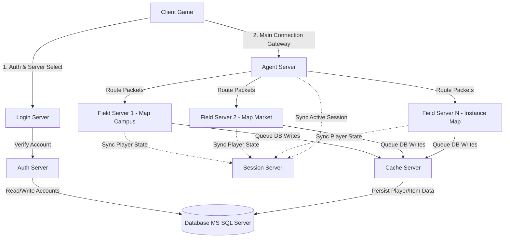

# Gambaran Umum Arsitektur Server Ran Online

Ran Online menggunakan arsitektur **Distributed Server** (server terdistribusi) untuk membagi beban komputasi dan memfasilitasi ribuan pemain yang terhubung secara bersamaan. Pendekatan ini umum digunakan pada MMORPG era 2000-an untuk mengatasi keterbatasan perangkat keras satu mesin tunggal.

---

## Diagram Hubungan Antar Komponen (Topologi)

Berikut adalah bagan hubungan dan alur komunikasi antar-komponen server Ran Online:

---

## Peran Masing-Masing Komponen

### 1. Client Game
Aplikasi desktop Windows yang berjalan pada komputer pemain. Berkomunikasi dengan server melalui protokol TCP kustom. Client melakukan dua tahap koneksi utama:
1. Menghubungi **Login Server** untuk otentikasi.
2. Membuka koneksi permanen ke **Agent Server** untuk bermain.

### 2. Login Server
Menjadi gerbang pertama pemain masuk ke dalam game. Tugas utamanya meliputi:
- Menerima permintaan *login* dari client.
- Meneruskan verifikasi akun ke [AuthServer](file:///Users/mochammad.emir/Library/Mobile%20Documents/com~apple%20CloudDocs/Code/ran-online/RanLogicServer/Server/AuthServer.cpp).
- Menampilkan daftar server (*World/Channel*) dan daftar karakter milik pemain.
- Memberikan token otentikasi/sesi kepada client untuk menghubungkannya ke **Agent Server**.

### 3. Agent Server
Pilar utama dalam mempertahankan koneksi pemain. Semua client terhubung ke Agent Server melalui port tertentu. Agent Server bertindak sebagai:
- **Proxy Gateway**: Mengurangi beban *handshake* jaringan dengan mempertahankan satu koneksi soket per client.
- **Packet Router**: Membaca ID peta/lokasi koordinat pemain, kemudian meneruskan paket gerakan/aksi pemain ke **Field Server** yang bertanggung jawab atas peta tersebut. Jika pemain pindah peta (*teleport*), client tidak perlu putus koneksi; Agent Server cukup mengubah tujuan perutean paket ke Field Server yang baru.

### 4. Field Server (s_CFieldServer)
Otak utama dari dunia game (*gameplay logic*). Setiap Field Server memproses satu atau beberapa peta (misal: *School Campus*, *Market Place*, *Dungeon*). Tugasnya meliputi:
- Memproses kecerdasan buatan NPC dan monster (*Monster AI*).
- Menangani kalkulasi pertarungan (*combat calculation*), *item drop*, *exp gain*, dan pergerakan objek di peta.
- Menerapkan siklus hidup lingkungan game (waktu, cuaca).
- Menyinkronkan perubahan *state* ke **Session Server** dan antrean penyimpanan data ke **Cache Server**.

### 5. Session Server
Pusat koordinasi sesi pemain yang terhubung secara global. Tugasnya:
- Mencatat pemain mana saja yang sedang online di semua Field Server/Channel.
- Memfasilitasi fitur komunikasi global: *Whisper* (PM), obrolan kelompok (*Party Chat*), obrolan organisasi (*Guild/Club Chat*).
- Mengelola pertemanan (*Friend List*) dan status *online/offline* secara *real-time*.

### 6. Cache Server (CCacheServer)
Layer perantara untuk optimasi penyimpanan database (*Database Write-Behind*). Tanpa Cache Server, ribuan transaksi data karakter dan *inventory* dari Field Server akan memacetkan database (MS SQL Server).
- Mengumpulkan pembaruan data dari Field Server.
- Menyimpan data karakter sementara di memori RAM.
- Melakukan operasi penulisan (*insert/update*) ke MS SQL Server secara berkala (periodik) atau saat pemain keluar (*logout*).

---

## Teknologi Kunci & Dependensi Saat Ini (Windows Native)

* **Model Jaringan**: Berbasis **Winsock IOCP** (I/O Completion Ports) untuk efisiensi penanganan ribuan koneksi konkuren di tingkat kernel Windows. Terlihat dari ketergantungan pada `CreateIoCompletionPort` di [NetServer.cpp](file:///Users/mochammad.emir/Library/Mobile%20Documents/com~apple%20CloudDocs/Code/ran-online/RanLogicServer/Server/NetServer.cpp).
* **Akses Database**: Menggunakan **ADO (ActiveX Data Objects)** dan **ODBC** berbasis teknologi COM Microsoft untuk berinteraksi dengan database relational. Diimplementasikan pada kelas [CjADO](file:///Users/mochammad.emir/Library/Mobile%20Documents/com~apple%20CloudDocs/Code/ran-online/SigmaCore/Database/Ado/AdoClass.h#L226).
* **Bahasa Pemrograman**: C++ standar (MSVC 2008) dengan dependensi MFC/ATL untuk GUI server berbasis Win32 Dialog.
