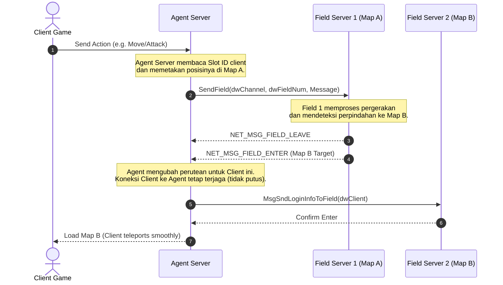

# Komponen Server: Agent Server

Agent Server (`CAgentServer`) adalah **gateway utama** dan **proxy** komunikasi bagi client. Seluruh koneksi *in-game* (saat bermain) dipertahankan oleh Agent Server. Client tidak berkomunikasi secara langsung dengan database atau Field Server (server peta), melainkan mempercayakan perutean pesan kepada Agent Server.

---

## Struktur Kode & Kelas Utama

* **Lokasi Source**:
  - Proyek Wrapper GUI: [AgentServer/](file:///Users/mochammad.emir/Library/Mobile%20Documents/com~apple%20CloudDocs/Code/ran-online/AgentServer)
  - Kelas Logika: [CAgentServer](file:///Users/mochammad.emir/Library/Mobile%20Documents/com~apple%20CloudDocs/Code/ran-online/RanLogicServer/Server/AgentServer.h)
  - Otentikasi Pengguna: [AgentServerMsgLogin.cpp](file:///Users/mochammad.emir/Library/Mobile%20Documents/com~apple%20CloudDocs/Code/ran-online/RanLogicServer/Server/AgentServerMsgLogin.cpp)
  - Penanganan Peta & Saluran: [AgentServerChannel.cpp](file:///Users/mochammad.emir/Library/Mobile%20Documents/com~apple%20CloudDocs/Code/ran-online/RanLogicServer/Server/AgentServerChannel.cpp)
  - Sinkronisasi Sesi: [AgentServerSession.cpp](file:///Users/mochammad.emir/Library/Mobile%20Documents/com~apple%20CloudDocs/Code/ran-online/RanLogicServer/Server/AgentServerSession.cpp)

---

## Alur Kerja Perutean Paket (Packet Routing)

Agent Server menjembatani koneksi TCP client dengan koneksi internal ke berbagai **Field Server** (peta) menggunakan topologi berikut:

---

## Fitur & Detail Teknis

### 1. Otentikasi Akun Regional
Di Ran Online, validasi kredensial (*username* dan *password*) dilakukan oleh Agent Server sesaat setelah client terhubung ke port-nya.
Karena Ran Online dipublikasikan di berbagai negara dengan sistem registrasi/billing berbeda, file [AgentServerMsgLogin.cpp](file:///Users/mochammad.emir/Library/Mobile%20Documents/com~apple%20CloudDocs/Code/ran-online/RanLogicServer/Server/AgentServerMsgLogin.cpp) mengimplementasikan beberapa metode masuk:
* `IdnMsgLogIn`: Logika login khusus untuk publisher Indonesia (menggunakan enkripsi token/kredensial lokal).
* `ThaiMsgLogin`, `ChinaMsgLogin`, `UsMsgLogin`, `DaumMsgLogin`: Handler login regional lainnya.
* Setelah diverifikasi, Agent Server akan memanggil database atau berkoordinasi dengan [AuthServer](file:///Users/mochammad.emir/Library/Mobile%20Documents/com~apple%20CloudDocs/Code/ran-online/RanLogicServer/Server/AuthServer.cpp) untuk mengonfirmasi validitas akun.

### 2. Manajemen Koneksi Field Server
Agent Server memelihara daftar koneksi soket aktif ke semua Field Server yang berjalan pada channel-nya:
* Data disimpan dalam array: `F_SERVER_INFO m_FieldServerInfo[MAX_CHANNEL_NUMBER][FIELDSERVER_MAX]`.
* Fungsi `FieldConnectAll()` bertugas menyambungkan Agent Server ke seluruh IP/port Field Server yang terdaftar di konfigurasi XML saat startup.
* Jika koneksi ke salah satu Field Server terputus, Agent Server akan otomatis mencoba menyambungkannya kembali (`FieldConnect`).

### 3. Fungsi Perutean Paket
Untuk mengirim dan membagikan data, kelas `CAgentServer` menyediakan beberapa metode pembungkus:
* `SendField(DWORD dwClient, ...)`: Mengirim data dari client tertentu ke Field Server tempat karakter pemain itu berada.
* `SendFieldSvr(int nSvrNum, ...)`: Mengirim data ke nomor Field Server tertentu.
* `BroadcastToField(...)` / `SendAllField(...)`: Mengirim data ke seluruh Field Server sekaligus (misal: pengumuman sistem/global server maintenance).
* `FieldMsgProcess(MSG_LIST* pMsg)`: Menampung seluruh data hasil komputasi Field Server (seperti pembaruan HP/MP monster, perubahan inventory, drop item) dan merutekannya kembali ke client bersangkutan.

### 4. Pencegahan Eksploitasi & Anti-Cheat
Agent Server berintegrasi dengan **nProtect GameGuard** melalui fungsi `AgentServerMsgNPROTECT.cpp`:
* Melakukan pertukaran kunci kriptografi (*handshake key*) berkala dengan modul anti-cheat yang terpasang di client game.
* Jika client gagal mengembalikan paket deteksi anti-cheat yang valid dalam waktu yang ditentukan, Agent Server akan memutuskan koneksi secara sepihak (`CloseClientAgentField`).
