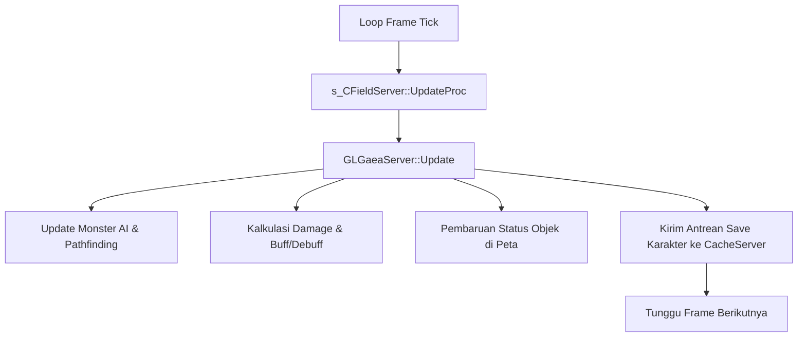

# Komponen Server: Field Server & Gaea Engine

Field Server (`CFieldServer`) dan **Gaea Engine** (`GLGaeaServer`) adalah **otak utama dari gameplay** game Ran Online. Ini adalah tempat di mana seluruh hukum fisika game, kecerdasan buatan (AI), mekanika pertarungan (combat), transaksi barang, quest, dan state dunia disimulasikan.

---

## Struktur Kode & Kelas Utama

* **Lokasi Source**:
  - Wrapper Server: [s_CFieldServer.cpp](file:///Users/mochammad.emir/Library/Mobile%20Documents/com~apple%20CloudDocs/Code/ran-online/RanLogicServer/Server/s_CFieldServer.cpp)
  - Game Engine Core: [GLGaeaServer.h](file:///Users/mochammad.emir/Library/Mobile%20Documents/com~apple%20CloudDocs/Code/ran-online/RanLogicServer/FieldServer/GLGaeaServer.h) & [GLGaeaServer.cpp](file:///Users/mochammad.emir/Library/Mobile%20Documents/com~apple%20CloudDocs/Code/ran-online/RanLogicServer/FieldServer/GLGaeaServer.cpp)
  - Penanganan Paket Gameplay: [GLGaeaServerMsg.cpp](file:///Users/mochammad.emir/Library/Mobile%20Documents/com~apple%20CloudDocs/Code/ran-online/RanLogicServer/FieldServer/GLGaeaServerMsg.cpp)
  - File Sub-Sistem Gameplay:
    - [GLGaeaServerInven.cpp](file:///Users/mochammad.emir/Library/Mobile%20Documents/com~apple%20CloudDocs/Code/ran-online/RanLogicServer/FieldServer/GLGaeaServerInven.cpp) (Manajemen Inventory & Barang)
    - [GLGaeaServerClub.cpp](file:///Users/mochammad.emir/Library/Mobile%20Documents/com~apple%20CloudDocs/Code/ran-online/RanLogicServer/FieldServer/GLGaeaServerClub.cpp) (Manajemen Guild/Club)
    - [GLGaeaServerParty.cpp](file:///Users/mochammad.emir/Library/Mobile%20Documents/com~apple%20CloudDocs/Code/ran-online/RanLogicServer/FieldServer/GLGaeaServerParty.cpp) (Manajemen Kelompok)
    - [GLGaeaServerVehicle.cpp](file:///Users/mochammad.emir/Library/Mobile%20Documents/com~apple%20CloudDocs/Code/ran-online/RanLogicServer/FieldServer/GLGaeaServerVehicle.cpp) (Kendaraan/Mount)
    - [GLGaeaServerInstantMap.cpp](file:///Users/mochammad.emir/Library/Mobile%20Documents/com~apple%20CloudDocs/Code/ran-online/RanLogicServer/FieldServer/GLGaeaServerInstantMap.cpp) (Peta Instansiasi / Dungeon)

---

## Alur Loop Game (Game Loop) Per Frame

Field Server berjalan dalam mode *high-frequency update loop* untuk menjaga pergerakan pemain tetap mulus (sinkronisasi frame tick):

---

## Fitur & Detail Teknis

### 1. Gaea Engine (`GLGaeaServer`)
Gaea Engine dimuat saat startup Field Server (`m_pGaeaServer = new GLGaeaServer(...)`). Engine ini menampung data game statis (seperti data map, monster spawn rate, quest script) ke dalam memori RAM, lalu mereferensikannya untuk kalkulasi dinamis.
* **Mekanika Combat**: Diatur di [GLGaeaServerMsg.cpp](file:///Users/mochammad.emir/Library/Mobile%20Documents/com~apple%20CloudDocs/Code/ran-online/RanLogicServer/FieldServer/GLGaeaServerMsg.cpp). Menghitung kalkulasi akurasi (*hit rate*), *dodge*, *critical damage*, pertahanan (*defense*), serta durasi *buff* dan efek status (*stun, burn, poison*).

### 2. Penanganan Memori & Auto-Restart
Karena server ini dikompilasi sebagai aplikasi 32-bit (x86) menggunakan MSVC 2008, ia rentan mengalami *Out of Memory* (batas alamat virtual memori RAM $\approx 2\text{ GB} - 3\text{ GB}$ pada Windows 32-bit):
* Field Server memantau memori secara berkala (`m_dwMemoryCheckTime`).
* Jika alokasi memori mendekati batas berbahaya atau ADO melemparkan error `e_out_of_memory`, server akan menetapkan kode kesalahan `m_dwErrorCode` dan secara otomatis memulai prosedur penghentian paksa secara aman (`ForceStop`) demi mencegah korupsi data karakter.

### 3. Peta Instansiasi (Instance Maps)
Dukungan untuk *dungeon* terisolasi di mana kelompok pemain dapat masuk tanpa gangguan pemain lain dikelola oleh [GLGaeaServerInstantMap.cpp](file:///Users/mochammad.emir/Library/Mobile%20Documents/com~apple%20CloudDocs/Code/ran-online/RanLogicServer/FieldServer/GLGaeaServerInstantMap.cpp):
* Field Server mengkloning data peta statis di memori secara dinamis untuk setiap instans baru yang diminta.
* Instans ini dihancurkan dari memori setelah batas waktu dungeon selesai atau semua pemain telah meninggalkan peta.

### 4. Sinkronisasi Data Karakter (Cache Server Slot)
Field Server tidak menulis data karakter langsung ke database SQL Server demi efisiensi I/O:
* Perubahan data (naik level, ganti barang, penyelesaian quest) dikirimkan dalam bentuk pesan biner ke slot **Cache Server** (`m_CacheServerSlot`).
* Cache Server yang akan mengumpulkan perubahan tersebut di antrean internal untuk kemudian ditulis secara asinkron ke database relational.
