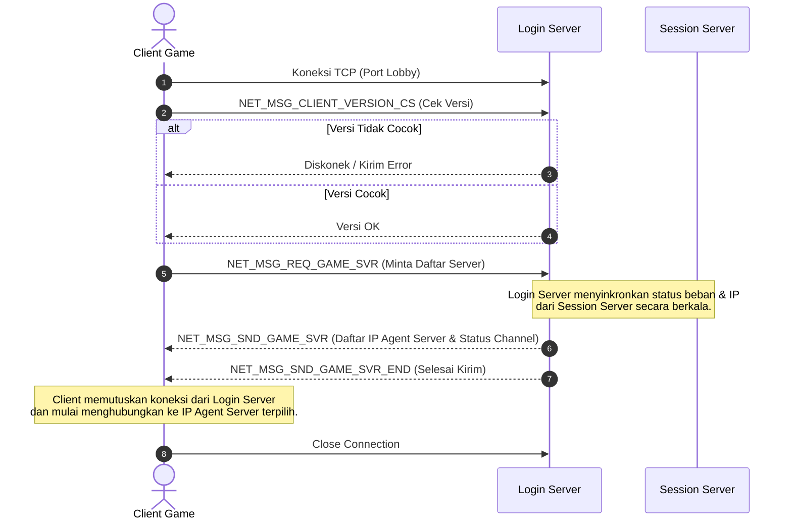

# Komponen Server: Login Server

Login Server (`CLoginServer`) bertindak sebagai **pintu masuk pertama** (lobby) bagi client game. Berbeda dari kebanyakan arsitektur modern di mana login server langsung memvalidasi *username* dan *password*, pada arsitektur Ran Online, Login Server terutama berfungsi sebagai **direktori server** untuk mendistribusikan daftar saluran (*channel/world*) dan mengarahkan pemain ke [Agent Server](file:///Users/mochammad.emir/Library/Mobile%20Documents/com~apple%20CloudDocs/Code/ran-online/RanLogicServer/Server/AgentServer.h) yang sesuai.

---

## Struktur Kode & Kelas Utama

* **Lokasi Source**:
  - Proyek Wrapper GUI: [LoginServer/](file:///Users/mochammad.emir/Library/Mobile%20Documents/com~apple%20CloudDocs/Code/ran-online/LoginServer)
  - Kelas Logika: [CLoginServer](file:///Users/mochammad.emir/Library/Mobile%20Documents/com~apple%20CloudDocs/Code/ran-online/RanLogicServer/Server/LoginServer.h) (mewarisi [NetServer](file:///Users/mochammad.emir/Library/Mobile%20Documents/com~apple%20CloudDocs/Code/ran-online/RanLogicServer/Server/NetServer.h))
  - Penanganan Pesan: [LoginServerMsg.cpp](file:///Users/mochammad.emir/Library/Mobile%20Documents/com~apple%20CloudDocs/Code/ran-online/RanLogicServer/Server/LoginServerMsg.cpp)
  - Koneksi ke Session Server: [LoginServerSession.cpp](file:///Users/mochammad.emir/Library/Mobile%20Documents/com~apple%20CloudDocs/Code/ran-online/RanLogicServer/Server/LoginServerSession.cpp)

---

## Alur Kerja Utama (Workflow)

---

## Fitur & Detail Teknis

### 1. Sinkronisasi Status Server via Session Server
Login Server tidak memantau beban Field Server secara langsung. Sebagai gantinya, ia terhubung ke **Session Server** melalui [LoginServerSession.cpp](file:///Users/mochammad.emir/Library/Mobile%20Documents/com~apple%20CloudDocs/Code/ran-online/RanLogicServer/Server/LoginServerSession.cpp):
* Login Server mengirim informasi dirinya dan menerima pembaruan berkala tentang status server (`SessionMsgSvrInfo`).
* Data disimpan ke dalam array dua dimensi: `G_SERVER_CUR_INFO_LOGIN m_sGame[MAX_SERVER_GROUP][MAX_CHANNEL_NUMBER]` yang menampung info kapasitas pemain, nama server, IP, port, dan status *maintenance*.

### 2. Penyaringan GeoIP (Geographical Access Control)
Terintegrasi dengan pustaka GeoIP (`GeoIP* m_pGeoIP`) untuk melakukan deteksi negara asal IP client.
* Daftar negara yang diperbolehkan diatur di dalam konfigurasi XML melalui variabel `m_setCountryAccessApprove`.
* Jika IP client berasal dari negara yang tidak terdaftar, Login Server dapat menolak koneksi lebih lanjut. Ini umum digunakan untuk mencegah serangan DDoS atau membatasi lisensi regional (IP Block).

### 3. Pemeriksaan Versi Client (`MsgVersion`)
Saat koneksi pertama, client wajib mengirimkan versi executable mereka. Fungsi `MsgVersion` di [LoginServerMsg.cpp](file:///Users/mochammad.emir/Library/Mobile%20Documents/com~apple%20CloudDocs/Code/ran-online/RanLogicServer/Server/LoginServerMsg.cpp#L67) membandingkan versi tersebut dengan versi server yang dikonfigurasi melalui berkas XML:
* Jika versi tidak sesuai, koneksi langsung ditutup untuk mencegah client dengan file game usang/modifikasi ilegal masuk ke sistem.
