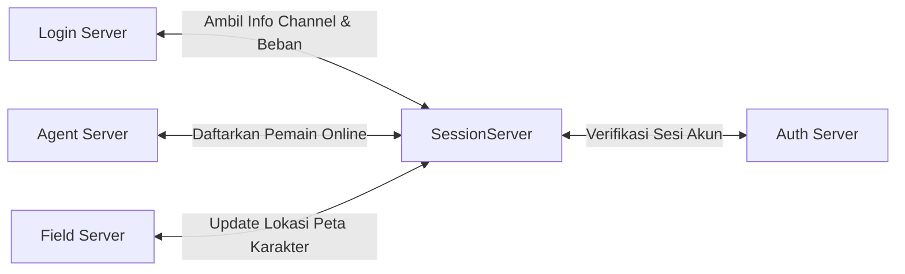

# Komponen Server: Session Server

Session Server (`CSessionServer`) bertindak sebagai **pusat koordinasi state global** dan komunikasi antar-server. Ia tidak berurusan dengan mekanika game (seperti combat atau pergerakan NPC), melainkan memastikan bahwa data sesi pemain, kapasitas saluran (*channel*), komunikasi obrolan (*chat*), dan status antar-server tersinkronisasi secara *real-time*.

---

## Struktur Kode & Kelas Utama

* **Lokasi Source**:
  - Proyek Wrapper GUI: [SessionServer/](file:///Users/mochammad.emir/Library/Mobile%20Documents/com~apple%20CloudDocs/Code/ran-online/SessionServer)
  - Kelas Logika: [CSessionServer](file:///Users/mochammad.emir/Library/Mobile%20Documents/com~apple%20CloudDocs/Code/ran-online/RanLogicServer/Server/SessionServer.h)
  - Penanganan Pesan: [SessionServerMsg.cpp](file:///Users/mochammad.emir/Library/Mobile%20Documents/com~apple%20CloudDocs/Code/ran-online/RanLogicServer/Server/SessionServerMsg.cpp) & [SessionServerMsgEx.cpp](file:///Users/mochammad.emir/Library/Mobile%20Documents/com~apple%20CloudDocs/Code/ran-online/RanLogicServer/Server/SessionServerMsgEx.cpp)
  - Thread Jaringan: [SessionServerThread.cpp](file:///Users/mochammad.emir/Library/Mobile%20Documents/com~apple%20CloudDocs/Code/ran-online/RanLogicServer/Server/SessionServerThread.cpp)

---

## Hubungan dan Aliran State Sesi

---

## Fungsi Utama & Fitur Teknis

### 1. Sinkronisasi Beban & Status Server
Session Server mengumpulkan status aktif dari seluruh saluran game (*channels*) dan menyediakannya untuk **Login Server**:
* Menyimpan array status saluran: `m_sServerChannel[MAX_SERVER_GROUP][MAX_CHANNEL_NUMBER]`.
* Fungsi `MsgServerInfo` dan `MsgServerCurInfo` menerima paket denyut jantung (*heartbeat*) dan statistik beban pemain dari Agent Server dan Field Server.
* Jika suatu saluran mencapai kapasitas batas pemain, status diatur menjadi *Full* (`m_bServerChannelFull = true`). Informasi ini dikirim ke Login Server (`SendVersionInfo`), sehingga pemain baru tidak dapat memilih saluran tersebut.

### 2. Distribusi Obrolan Global & Sosial (Chat Relay)
Ketika pemain mengirim pesan ke party, guild, atau obrolan global, paket dikirim dari client ke Agent Server, lalu diteruskan ke Session Server:
* **Fungsi `MsgChatProcess`**: Menentukan jenis obrolan. Jika bertipe obrolan organisasi (Guild) atau kelompok (Party) di mana anggotanya tersebar di peta (Field Server) yang berbeda, Session Server melacak Slot ID anggotanya dan meneruskan pesan tersebut ke Agent Server masing-masing anggota.
* **Fungsi `MsgSndChatGlobal`**: Melakukan siaran (*broadcast*) obrolan admin/sistem (pengumuman berjalan merah di atas layar) ke seluruh client game di semua saluran.

### 3. Pelacakan Masuk/Keluar Karakter (`Character Tracking`)
Session Server mencatat status online setiap karakter untuk mencegah login ganda (*double login*):
* **`MsgChaIncrease` & `MsgTestChaIncrease`**: Dipanggil saat karakter berhasil memasuki game world, menambahkan jumlah pemain online aktif.
* **`MsgChaDecrease` & `MsgTestChaDecrease`**: Dipanggil saat karakter keluar dari game world atau berpindah saluran.
* Jika ada permintaan masuk untuk akun yang statusnya masih tercatat online (menggantung), Session Server akan menginstruksikan Agent Server yang menampung sesi sebelumnya untuk segera memutuskan koneksi akun tersebut (*kick*).

### 4. Distribusi Perintah GM (Game Master Command)
* Memproses fungsi seperti `MsgGmLogItemReloadAS` dan `MsgGmGameDataUpdateAS`.
* Ketika GM memperbarui konfigurasi drop item atau data event exp (`MsgEventExpMS`), Session Server menyebarkan instruksi pembaruan ini ke seluruh Agent Server dan Field Server yang aktif secara dinamis tanpa perlu me-restart server.
