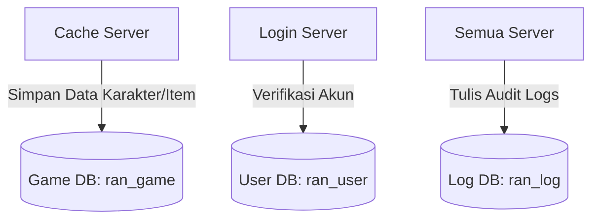

# Skema & Akses Database

Sistem penyimpanan data Ran Online memisahkan informasi ke dalam tiga basis data relasional logis untuk mengoptimalkan kinerja I/O dan mempermudah administrasi data. Saat ini, sistem bergantung sepenuhnya pada **Microsoft SQL Server** yang diakses secara asinkron menggunakan teknologi Windows-native.

---

## Pembagian Database (Logical Separation)

### 1. User Database (`ran_user`)
Mengelola akun pemain, tingkat keamanan, hak akses GM, riwayat login, dan status pemblokiran (*ban*).
* **Source Utama**: [AdoManagerUser.cpp](file:///Users/mochammad.emir/Library/Mobile%20Documents/com~apple%20CloudDocs/Code/ran-online/RanLogicServer/Database/ADO/AdoManagerUser.cpp)
* **Prosedur Penting**:
  - `dbo.sp_SelectUserCountry`: Memverifikasi geolokasi IP akun.
  - `dbo.gsp_user_gettype`: Memvalidasi kredensial pengguna dan mengembalikan status jenis akun (regular/GM).
  - `dbo.sp_gmEditLog`: Mencatat riwayat modifikasi akun oleh Game Master.

### 2. Game Database (`ran_game`)
Menyimpan seluruh data karakter, status, posisi koordinat peta terakhir, daftar keahlian (*skills*), inventaris barang (*inventory*), status pertemanan, dan data keorganisasian (Guild/Club).
* **Source Utama**:
  - Pemuatan Karakter: [AdoManagerGameCharLoad.cpp](file:///Users/mochammad.emir/Library/Mobile%20Documents/com~apple%20CloudDocs/Code/ran-online/RanLogicServer/Database/ADO/AdoManagerGameCharLoad.cpp)
  - Penyimpanan Karakter: [AdoManagerGameCharSave.cpp](file:///Users/mochammad.emir/Library/Mobile%20Documents/com~apple%20CloudDocs/Code/ran-online/RanLogicServer/Database/ADO/AdoManagerGameCharSave.cpp)
  - Manajemen Guild: [AdoManagerGameClub.cpp](file:///Users/mochammad.emir/Library/Mobile%20Documents/com~apple%20CloudDocs/Code/ran-online/RanLogicServer/Database/ADO/AdoManagerGameClub.cpp)
* **Prosedur Penting**:
  - `dbo.sp_create_guild` & `dbo.sp_add_guild_member`: Logika pembuatan guild dan penambahan anggota.
  - `dbo.sp_GetGuildMoney`: Mengambil uang organisasi dari bank guild.

### 3. Log Database (`ran_log`)
Penyimpanan riwayat transaksi dan log audit untuk kebutuhan forensik game. Penulisan log dilakukan secara masif dan searah (*write-heavy*).
* **Source Utama**: [AdoManagerLog.cpp](file:///Users/mochammad.emir/Library/Mobile%20Documents/com~apple%20CloudDocs/Code/ran-online/RanLogicServer/Database/ADO/AdoManagerLog.cpp)
* **Log yang Dicatat**: Log perdagangan antar-pemain (*trade*), pembuangan item (*item drop/trash*), penggunaan item premium (mall shop), dan aktivitas pertarungan khusus.

---

## Driver & Mekanisme Akses Saat Ini (Windows Native)

Akses database menggunakan **ActiveX Data Objects (ADO)** dan **OLE DB Provider** untuk SQL Server (`SQLOLEDB.1`).
* Menggunakan COM smart pointers (`_ConnectionPtr`, `_CommandPtr`, `_RecordsetPtr`) dari runtime Windows.
* Koneksi dibangun dinamis via format string di [AdoConnectionString.cpp](file:///Users/mochammad.emir/Library/Mobile%20Documents/com~apple%20CloudDocs/Code/ran-online/SigmaCore/Database/Ado/AdoConnectionString.cpp#L68).
* Pola eksekusi query **99% berbasis Stored Procedure** (`ExecuteStoredProcedure` / `Execute4Cmd` dengan tipe `adCmdStoredProc`).

---

## Asesmen Kelayakan Migrasi ke PostgreSQL (Cloud-Native)

Migrasi database dari MS SQL Server ke PostgreSQL Cloud-Native (seperti Amazon RDS PostgreSQL atau Cloud SQL Google Cloud) sangat layak dilakukan, tetapi membutuhkan penulisan ulang pada layer akses data:

### 1. Dependensi ADO (Windows-Only)
* **Masalah**: ADO menggunakan COM runtime Windows yang tidak bisa dijalankan di Linux.
* **Solusi**: Lapisan abstraksi database di [AdoClass.cpp](file:///Users/mochammad.emir/Library/Mobile%20Documents/com~apple%20CloudDocs/Code/ran-online/SigmaCore/Database/Ado/AdoClass.cpp) harus ditulis ulang menggunakan pustaka driver database C++ cross-platform (seperti `libpqxx` untuk PostgreSQL, atau ODBC driver Linux).

### 2. Konversi Sintaks Stored Procedure (T-SQL vs PL/pgSQL)
* **Masalah**: Ran Online memiliki lebih dari 1.000 panggilan prosedur tersimpan yang ditulis dalam bahasa **Transact-SQL (T-SQL)** MS SQL. T-SQL memiliki perbedaan mendasar dengan **PL/pgSQL** PostgreSQL, terutama pada:
  - Deklarasi parameter menggunakan simbol `@` (PostgreSQL menggunakan nama variabel biasa atau posisi `$1`).
  - Cara menangani auto-increment ID (`SELECT @@IDENTITY` atau `SCOPE_IDENTITY()` vs `RETURNING id` di PostgreSQL).
  - Skema penanganan error (`BEGIN TRY ... END TRY` vs `EXCEPTION` block).
* **Solusi**:
  - Menggunakan tools migrasi skema otomatis (seperti `pgloader` atau `AWS Schema Conversion Tool`) untuk mengubah struktur tabel dan fungsi dasar.
  - Menulis ulang stored procedure kritis (seperti *Guild creation* dan *Character Save*) ke dalam format fungsi PL/pgSQL.

### 3. Pemetaan Tipe Data
Beberapa tipe data Microsoft SQL Server harus dipetakan ulang saat migrasi ke PostgreSQL:

| Tipe Data MS SQL Server | Padanan PostgreSQL | Catatan |
| :--- | :--- | :--- |
| `DATETIME` / `SMALLDATETIME` | `TIMESTAMP` / `TIMESTAMPTZ` | PostgreSQL mendukung timezone secara native. |
| `NVARCHAR(n)` | `VARCHAR(n)` | PostgreSQL mengolah encoding UTF-8 secara native tanpa prefix `N`. |
| `IMAGE` / `VARBINARY(max)` | `BYTEA` | Digunakan untuk menyimpan blob data karakter yang terkompresi. |
| `BIT` | `BOOLEAN` | Menggantikan representasi flag $0/1$. |
