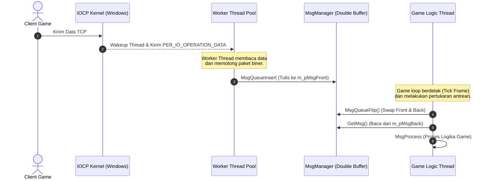

# Protokol & Komunikasi Jaringan

Ran Online dikembangkan dengan fokus pada performa jaringan tinggi dan latensi rendah. Sistem komunikasi antar-server serta server-client didesain secara asinkron menggunakan protokol biner TCP kustom di atas teknologi kernel Windows.

---

## Model Jaringan: Winsock IOCP (I/O Completion Ports)

Untuk mendukung ribuan koneksi konkuren per server, Ran Online menggunakan model **I/O Completion Ports (IOCP)**. Ini adalah model I/O asinkron paling efisien di Windows.



---

## Manajemen Memori Jaringan (Buffer Allocation)

Untuk menghindari fragmentasi memori (*heap fragmentation*) akibat alokasi dan dealokasi buffer jaringan secara konstan, Ran Online menggunakan pola **Object Pool**:
* **`PER_IO_OPERATION_DATA`**: Struktur utama yang menampung buffer data soket (`Buffer[2048]` bytes) dan struktur `OVERLAPPED` Windows. Struktur ini wajib diletakkan di alamat memori teratas.
* **`sc::net::Overlapped`**: Kelas pool memori di [Overlapped.h](file:///Users/mochammad.emir/Library/Mobile%20Documents/com~apple%20CloudDocs/Code/ran-online/SigmaCore/Net/Overlapped.h#L30) yang mengelola alokasi buffer. Ia menggunakan `boost::object_pool` untuk meminimalkan waktu pemanggilan `new` dan `delete`.
* **`sc::net::IOManager`**: Mengelola pool terpisah untuk operasi kirim (`m_Send`) dan terima (`m_Recv`).

---

## Pola Antrean Pesan: Double-Buffering (MsgManager)

Agar thread pekerja I/O (IOCP) tidak menghambat thread logika game (*game loop*), Ran Online menerapkan pola antrean **Double-Buffering** melalui kelas [MsgManager](file:///Users/mochammad.emir/Library/Mobile%20Documents/com~apple%20CloudDocs/Code/ran-online/SigmaCore/Net/MsgList.h#L112):

1. **Front Queue (`m_pMsgFront`)**: Tempat di mana thread pekerja IOCP memasukkan paket data yang baru diterima menggunakan fungsi `MsgQueueInsert`. Operasi ini membutuhkan kunci (*lock*) singkat.
2. **Back Queue (`m_pMsgBack`)**: Tempat di mana thread logika game membaca paket untuk diproses.
3. **Flip (`MsgQueueFlip`)**: Pada awal setiap frame tick logika game, thread logika menukar penunjuk (*pointer*) antara Front Queue dan Back Queue. Dengan begitu, thread logika dapat membaca paket dari Back Queue dengan aman tanpa takut berbenturan kunci dengan thread pekerja IOCP yang terus menulis ke Front Queue.

### Alternatif Concurrency: Intel TBB
Jika konstanta compiler `_USE_TBB` (Intel Threading Building Blocks) diaktifkan, double-buffering dinonaktifkan dan diganti dengan struktur data konkuren tingkat tinggi: `tbb::concurrent_queue<MSG_LIST*>`.

---

## Struktur Paket & Kompresi Data

### 1. Header Paket Biner
Setiap pesan jaringan ditransmisikan sebagai aliran byte biner yang diawali dengan header generik:
```cpp
struct NET_MSG_GENERIC
{
    WORD nSize;  // Ukuran total paket (termasuk data)
    WORD nType;  // ID Tipe Pesan (NET_MSG_...)
    // ... data biner mengikuti setelah header
};
```

### 2. Kompresi Paket
Jika ukuran payload paket melebihi batas `COMPRESS_PACKET_SIZE` ($1000$ bytes, didefinisikan di [NetDefine.h](file:///Users/mochammad.emir/Library/Mobile%20Documents/com~apple%20CloudDocs/Code/ran-online/SigmaCore/Net/NetDefine.h#L17)), server akan otomatis mengompresi payload menggunakan pustaka **ZLIB** sebelum mengirimkannya melalui soket TCP untuk menghemat bandwidth jaringan.

---

## Tantangan Migrasi ke Cross-Platform (Linux / Cloud-Native)

Model jaringan ini sangat terikat pada Windows API. Untuk melakukan porting ke Linux/Cloud-Native:
* **IOCP Replacement**: Fungsi `CreateIoCompletionPort` dan `GetQueuedCompletionStatus` harus diganti dengan abstraksi jaringan cross-platform seperti **epoll** (Linux), **kqueue** (macOS), atau pustaka jaringan modern seperti **boost::asio** / **libuv**.
* **WinSock API**: Pemanggilan fungsi Winsock khusus seperti `WSASend`, `WSARecv`, `WSAEventSelect` harus dialihkan ke standar soket POSIX.
