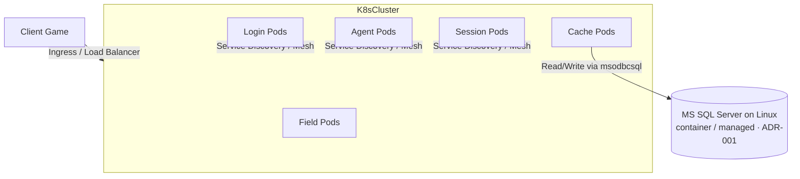

# Peta Jalan & Asesmen Kelayakan Cloud-Native

Dokumen ini menyajikan penilaian kelayakan (*feasibility assessment*) dan rencana migrasi arsitektur Ran Online server dari lingkungan *on-premise Windows-centric* ke arsitektur **Cloud-Native cross-platform** yang aman, fleksibel, dan mematuhi regulasi ketat (seperti prinsip tata kelola IT perbankan OJK - POJK 11/2022).

> ⚠️ **Keputusan database diperbarui oleh [ADR-001](adr/ADR-001-cloud-native-vs-rejuvenation.md).** Versi awal dokumen ini mengusulkan migrasi langsung ke PostgreSQL. Keputusan resmi sekarang adalah **Hybrid — Microsoft SQL Server berjalan di atas Linux container** (driver `msodbcsql`/ODBC menggantikan ADO COM), sehingga 1.000+ stored procedure T-SQL **tidak perlu ditulis ulang**. Migrasi ke **PostgreSQL = opsi Fase 2** (opsional) setelah server C++ stabil di Kubernetes. Bagian di bawah sudah disesuaikan; analisis PostgreSQL dipertahankan sebagai jalur Fase 2. Lihat juga [master plan](06_master_plan.md).

---

## Target Arsitektur Masa Depan (Target State)

---

## Analisis Kelayakan Porting (Feasibility Assessment)

Porting server Ran Online langsung dari C++ Windows ke Linux C++ adalah tugas yang menantang namun sangat layak dengan pendekatan modular.

### 1. Jaringan & I/O (IOCP vs Epoll)
* **Kelayakan**: **Sedang**
* **Analisis**: Winsock IOCP (`CreateIoCompletionPort`) sangat berbeda secara arsitektur dengan Linux `epoll` atau macOS `kqueue`.
* **Rekomendasi**: Mengintegrasikan **`boost::asio`** atau **`libuv`** ke dalam [NetServer.cpp](file:///Users/mochammad.emir/Library/Mobile%20Documents/com~apple%20CloudDocs/Code/ran-online/RanLogicServer/Server/NetServer.cpp) untuk mengabstraksi lapisan jaringan secara cross-platform tanpa menulis ulang logika perutean paket.

### 2. Layer Database (ADO/OLE DB → ODBC, SQL Server dipertahankan)
* **Kelayakan**: **Sedang** (dengan strategi Hybrid; risiko jauh lebih rendah dari rewrite DB)
* **Analisis**: Yang tidak bisa jalan di Linux adalah **runtime akses datanya** (COM OLE DB/ADO di [AdoClass.cpp](file:///Users/mochammad.emir/Library/Mobile%20Documents/com~apple%20CloudDocs/Code/ran-online/SigmaCore/Database/Ado/AdoClass.cpp)) — **bukan** SQL Server-nya. Per [ADR-001](adr/ADR-001-cloud-native-vs-rejuvenation.md), engine SQL Server dipertahankan (berjalan di Linux container), sehingga stored procedure T-SQL tetap utuh. Jumlah SP sebenarnya divalidasi via [runbook restore `.bak`](runbooks/db-restore.md).
* **Rekomendasi (Fase 1 — Hybrid)**:
  1. Ganti runtime OLE DB/ADO dengan **Microsoft ODBC Driver for SQL Server (`msodbcsql`)** di belakang interface `CjADO` (perubahan terlokalisir, logika SP tak berubah).
  2. Restore 8 `.bak` ke SQL Server on Linux & audit kompatibilitas — lihat [runbook](runbooks/db-restore.md).
* **Opsi Fase 2 (opsional, hapus lisensi SQL Server)**: bila kelak ingin keluar dari lisensi, barulah migrasi ke PostgreSQL — `libpqxx` (driver C++), `pgloader` (skema/tabel), konversi SP kritis ke **PL/pgSQL**. *Bukan* prasyarat go-live.

### 3. Kompilasi & Compiler (MSVC vs GCC/Clang)
* **Kelayakan**: **Tinggi**
* **Analisis**: Kode C++ di Ran Online menggunakan ekstensi compiler MSVC (seperti `#pragma once`, `#import`, tipe Windows `DWORD`, `HANDLE`).
* **Rekomendasi**:
  1. Ganti tipe data Win32 dengan pustaka standar C++ (misal: `DWORD` $\rightarrow$ `uint32_t`, `HANDLE` $\rightarrow$ file descriptor / abstraksi kustom).
  2. Buat sistem build menggunakan **CMake** untuk menggantikan file proyek Visual Studio (`.vcproj`).

---

## Peta Jalan Migrasi (Roadmap)

### Fase 0: Discovery DB (Spike #0 — prasyarat)
* **Tujuan**: Membuktikan asumsi ADR-001 sebelum porting penuh.
* **Langkah**: Restore 8 `.bak` ke SQL Server on Linux, hasilkan **SP Inventory** + **Linux Incompatibility Report** — lihat [runbook](runbooks/db-restore.md).

### Fase 1: Abstraksi OS & Database (Tahap Persiapan)
* **Tujuan**: Membuat kode server dapat berjalan di Linux terlebih dahulu (Cross-platform compilation).
* **Langkah**:
  - Konversi file solusi visual studio ke CMake.
  - Implementasi layer database baru menggunakan driver **`msodbcsql`/ODBC** ke SQL Server on Linux (interface `CjADO` dipertahankan).
  - Porting socket loop menggunakan `boost::asio`.

### Fase 2: Kontainerisasi (Docker & OCI Images)
* **Tujuan**: Mengemas setiap server ke dalam kontainer Linux yang ringan dan aman.
* **Langkah**:
  - Membuat `Dockerfile` multi-stage untuk kompilasi dan runtime server.
  - Memastikan base image menggunakan distro minimalis yang aman (seperti Alpine Linux atau Distroless) untuk memperkecil celah keamanan (*attack surface*).

### Fase 3: Orkestrasi & Cloud-Native Deployment (Kubernetes)
* **Tujuan**: Skalabilitas dinamis dan pemantauan kesehatan server otomatis.
* **Langkah**:
  - Mengonfigurasi Kubernetes Deployment untuk LoginServer, AgentServer, dan FieldServer.
  - Menggunakan Kubernetes *Headless Services* untuk menjaga rute komunikasi soket tetap presisi antara Agent dan Field Server.

---

## Kepatuhan POJK 11/2022 (Cloud-Exit & Keamanan Perbankan)

Mengingat pentingnya kepatuhan regulasi di sektor keuangan (OJK), refaktor cloud-native ini wajib menerapkan prinsip-prinsip berikut:

### 1. Strategi Keluar Cloud (Cloud-Exit Strategy)
* **Prinsip**: Server tidak boleh bergantung pada layanan proprietari cloud tertentu (seperti AWS Fargate eksklusif atau DB Serverless eksklusif).
* **Penerapan**: Menggunakan standar Kubernetes (K8s) murni dan database SQL standar (PostgreSQL) agar beban kerja server game dapat dipindahkan secara instan ke cloud provider lain (multi-cloud) atau kembali ke pusat data lokal (*on-premises hybrid*) jika terjadi kegagalan sistemik.

### 2. Kedaulatan & Perlindungan Data (Data Sovereignty)
* **Prinsip**: Data pemain dan akun harus disimpan di dalam wilayah hukum Indonesia.
* **Penerapan**: Deployment infrastruktur cloud wajib ditempatkan pada region lokal (misal: AWS Jakarta Region `ap-southeast-3` atau Google Cloud Jakarta `asia-southeast2`).

### 3. Keamanan dengan Prinsip Least Privilege
* **Prinsip**: Hak akses resource seminimal mungkin (Zero IAM Wildcard).
* **Penerapan**: Penggunaan Kubernetes Service Accounts yang terintegrasi dengan IAM Roles (IRSA) untuk membatasi akses Pod server game ke database PostgreSQL. Tidak boleh ada secrets (kredensial DB) yang disimpan keras (*hardcoded*) di dalam file kode sumber atau image Docker; gunakan rahasia Kubernetes atau Cloud Secret Manager.

### 4. Zero-Drift & High Auditability
* **Prinsip**: Seluruh infrastruktur dideklarasikan secara tertulis dan dapat diaudit.
* **Penerapan**: Semua sumber daya cloud (VPC, PostgreSQL Instance, Kubernetes Cluster) dideklarasikan menggunakan **Terraform**. Setiap perubahan infra wajib melalui pipa CI/CD GitOps (misal: Terraform Cloud / Atlantis) untuk mencegah *drift* (perbedaan konfigurasi manual) dan menjaga jejak audit yang bersih.
