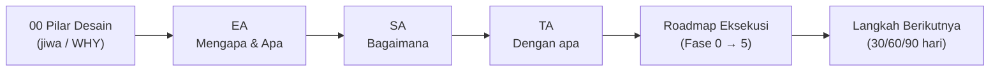
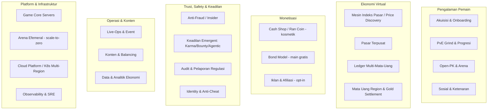
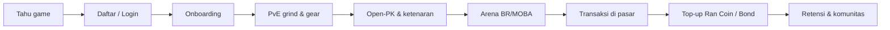
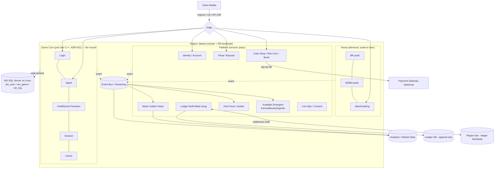
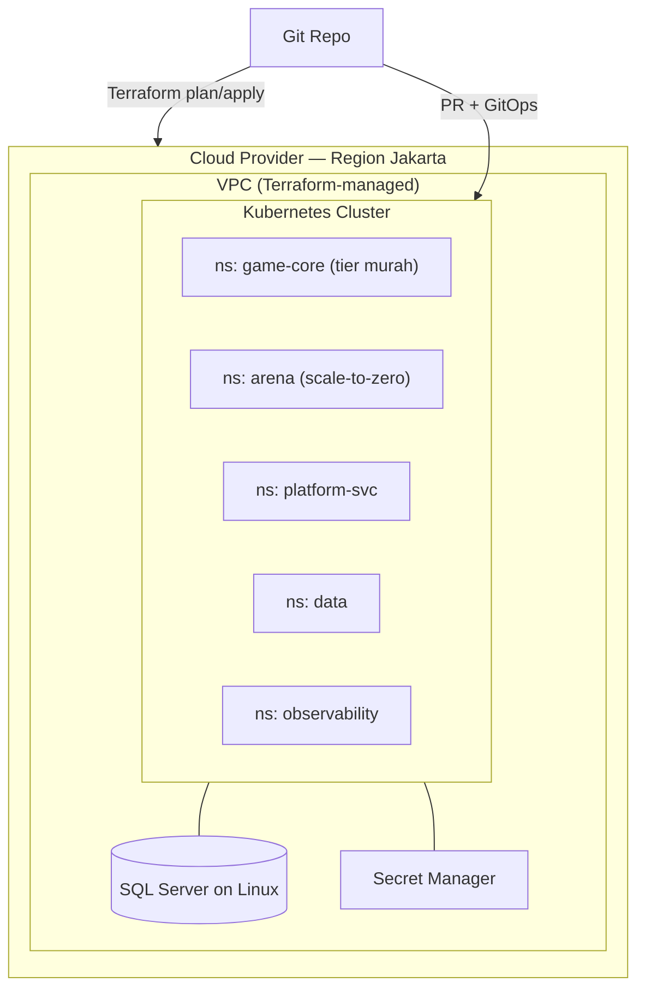
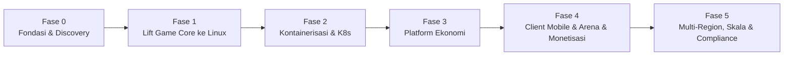

# Master Plan Arsitektur & Eksekusi: Modernisasi & Reimajinasi Ran Online

**Status**: Draft v1 · **Tanggal**: 2026-06-14 · **Pemilik**: Lead Infrastructure / Enterprise Architect

> **Prasyarat — baca [`00_design_pillars.md`](00_design_pillars.md) lebih dulu.** Dokumen pilar adalah *north-star* (visi, jiwa, prinsip, konsep game, ekonomi, monetisasi, tata kelola). **Dokumen ini melengkapinya dari sisi arsitektur & eksekusi**: ia menerjemahkan pilar menjadi rencana berlapis **Enterprise Architecture → Solution Architecture → Technology Architecture**, lalu menjadi peta jalan dan langkah konkret berikutnya. Pilar menjawab *mengapa*; master plan ini menjawab *bagaimana membangunnya*.

---

## 0. Cara Membaca Dokumen Ini

Master plan ini memakai kerangka berlapis ala TOGAF. Tiap lapisan menjawab pertanyaan berbeda dan turun secara berurutan — prinsip di EA membatasi SA, SA membatasi TA. Jika ada konflik, lapisan di atasnya menang.

| Lapisan | Pertanyaan | Fokus | Bagian |
| :--- | :--- | :--- | :---: |
| **Enterprise Architecture (EA)** | *Mengapa & Apa* | Visi, kapabilitas, prinsip, regulasi | [§2](#2-lapisan-1--enterprise-architecture) |
| **Solution Architecture (SA)** | *Bagaimana* | Aplikasi, data, integrasi, keamanan, client | [§3](#3-lapisan-2--solution-architecture) |
| **Technology Architecture (TA)** | *Dengan apa* | Compute, build, infra, observability, CI/CD | [§4](#4-lapisan-3--technology-architecture) |

**Peta seluruh dokumen `docs/`** (master plan ini merangkai, tidak menggantikan):

- [`00_design_pillars.md`](00_design_pillars.md) — **north-star desain** (jiwa & WHY). Input utama lapisan EA.
- [`01_architecture_overview.md`](01_architecture_overview.md) · [`02_server_components/`](02_server_components/) — arsitektur server warisan (as-is).
- [`03_database_schema.md`](03_database_schema.md) · [`04_network_protocol.md`](04_network_protocol.md) — detail data & protokol as-is.
- [`05_cloud_native_roadmap.md`](05_cloud_native_roadmap.md) — kelayakan porting + roadmap 3 fase.
- [`07_ai_delivery_operating_model.md`](07_ai_delivery_operating_model.md) — model eksekusi tim AI-agent & rubrik dekomposisi "chip" (ringkas di [§8](#8-model-eksekusi-tim-ai-agent--dekomposisi-chip-pekerjaan)).
- [`runbooks/db-restore.md`](runbooks/db-restore.md) — runbook Spike #0 (restore `.bak` + SP inventory).
- [`adr/ADR-001`](adr/ADR-001-cloud-native-vs-rejuvenation.md) — **keputusan arsitektur inti**.
- [`future_enhancements/`](future_enhancements/) — pasar terpusat, ledger setara perbankan, pencegahan fraud orang dalam.

> ⚠️ **Rekonsiliasi keputusan database.** [`05`](05_cloud_native_roadmap.md) masih menulis migrasi langsung ke PostgreSQL (`libpqxx`, PL/pgSQL). Itu **digantikan** oleh [ADR-001](adr/ADR-001-cloud-native-vs-rejuvenation.md): keputusan resmi = **Hybrid, Microsoft SQL Server di atas Linux container** (driver `msodbcsql` menggantikan ADO COM) agar 1.000+ stored procedure T-SQL tidak ditulis ulang. PostgreSQL = **opsi Fase 2** setelah C++ stabil di K8s. `05` perlu di-update agar konsisten (lihat [§6](#6-apa-yang-perlu-disiapkan-selanjutnya)).

---

## 1. Ringkasan Eksekutif

Kita memiliki source code MMORPG Ran Online (basis *Smtm*, C++ VS2008, Windows-native) berusia 20+ tahun yang stabil & *battle-tested*, tetapi terkunci pada ekosistem Windows (Winsock IOCP, ADO/COM, MFC, MS SQL Server). Tujuan akhir — sesuai [pilar desain](00_design_pillars.md) — bukan sekadar memindahkan game lama ke cloud, melainkan **reimajinasi mobile yang pro-pemain & anti-judi**: ekonomi region-based yang sehat karena digerakkan *price discovery*/indeks pasar, monetisasi break-even (Ran Coin, loop tertutup, tanpa *cash-out* fiat), dunia Open-PK 24/7 dengan keadilan *emergent* (bukan polisi GM), dan tata kelola ekonomi setara perbankan (POJK 11/2022).

Benang merah pilar yang menyetir arsitektur: **OpEx rendah = kemerdekaan etis** (prinsip 4). Karena itu efisiensi infrastruktur bukan sekadar teknik — ia menurunkan ambang impas sehingga proyek mampu *menolak* monetisasi predatoris.

Pendekatannya **dua lapis dan bertahap**:

1. **Fondasi (Modernisasi)** — angkat *game core* C++ ke Linux tanpa menyentuh logika game, kemas jadi kontainer, orkestrasi dengan Kubernetes. Risiko rendah, sesuai [ADR-001](adr/ADR-001-cloud-native-vs-rejuvenation.md).
2. **Produk (Reimajinasi)** — bangun *platform services* baru di sekeliling game core (mesin indeks pasar, ledger multi-mata-uang, pasar terpusat, anti-fraud, cash shop Ran Coin), lalu client mobile + arena.

**Target keberhasilan Fase Fondasi**: server C++ jalan di Kubernetes region Indonesia (`ap-southeast-3` Jakarta) dalam **4–6 minggu** (augmentasi AI), nol regresi ekonomi/combat, lisensi OS Windows = Rp 0, infrastruktur 100% IaC + GitOps dan portabel antar-cloud (*cloud-exit ready*).

---

## 2. Lapisan 1 — Enterprise Architecture

### 2.1 Visi & Pilar (diturunkan dari `00_design_pillars.md`)

Lapisan EA **tidak mengulang** pilar desain, melainkan mengikatnya sebagai batasan arsitektur. Lima prinsip keras (lihat [pilar §1](00_design_pillars.md)) yang mengikat semua keputusan turunan:

1. **Tanpa gacha, tanpa judi.**
2. **Ekonomi dinamis mengikuti indeks pasar** (*price discovery*, bukan harga tetap/RNG).
3. **Hormati waktu pemain** — sesi bermakna berbatas; *sustainability* di atas *engagement*.
4. **Monetisasi untuk bertahan (break-even)** — *OpEx rendah = kemerdekaan etis*.
5. **Jaga chaos** — *govern the economy hard, govern the playground light*.

### 2.2 Tujuan Bisnis & Metrik Sukses

| # | Tujuan Bisnis | Metrik (KPI/OKR) | Target Awal |
| :-: | :--- | :--- | :--- |
| O1 | Modernisasi tanpa regresi | Paritas fungsional vs server lama | 100% fitur inti, 0 regresi ekonomi/combat |
| O2 | OpEx rendah & portabilitas | Biaya/ pemain-konkuren; waktu cloud-exit | OS license Rp 0; arena scale-to-zero saat idle |
| O3 | Ekonomi sehat | Inflasi mata uang lokal per-region; harga NPC dinamis | Inflasi pada band target; harga ikut money supply |
| O4 | Monetisasi etis & berkelanjutan | Pendapatan vs OpEx; mekanik gacha | Break-even; **0** gacha; **0** P2W |
| O5 | Kepatuhan & kepercayaan | Audit trail; insiden fraud; data residency | 100% transaksi ekonomi ter-ledger & dapat diaudit |
| O6 | Skala efisien | Pemain konkuren/cluster; biaya tier dunia vs arena | Skala horizontal; arena efemeral per-region |

### 2.3 Prinsip Arsitektur (tambahan untuk delivery)

Selain 5 pilar desain (§2.1), keputusan teknis dipandu prinsip arsitektur berikut. Jika sebuah desain melanggarnya, desain itu yang berubah.

| # | Prinsip Arsitektur | Implikasi praktis | Sumber |
| :-: | :--- | :--- | :--- |
| A1 | **Compliance-by-design (POJK 11/2022)** | Auditability, least privilege, data residency = syarat keras. | Regulasi |
| A2 | **Cloud-portability / exit-first** | Hanya K8s murni + SQL standar; hindari lock-in proprietari. | ADR-001 |
| A3 | **Risiko rendah dulu** | Port C++ dulu; pertahankan engine DB asli (T-SQL). | ADR-001 |
| A4 | **Pisahkan tier biaya** | Dunia persisten = tier murah (tick lambat); arena = pod efemeral *scale-to-zero*. | Pilar §7 |
| A5 | **Multi-region berdaulat** | Tiap region = cluster K8s + DB sendiri di yurisdiksinya; lintas-region = settlement, bukan konsistensi global. | Pilar §4/§7 |
| A6 | **Inovasi di tepi, paritas di inti** | Game core jaga paritas; ekonomi/monetisasi/kepatuhan hidup sebagai service terpisah via event bus. | A3 |
| A7 | **Everything-as-code & auditable** | Semua infra via Terraform + GitOps (zero-drift). | POJK |
| A8 | **AI-augmented delivery** | Porting & dokumentasi dipercepat agen AI; *human review* wajib pada logika ekonomi/combat. | — |

### 2.4 Peta Kapabilitas Bisnis

### 2.5 Value Stream Pemain

### 2.6 Operating Model & Stakeholder

| Peran | Tanggung jawab utama | Lapisan dominan |
| :--- | :--- | :--- |
| Enterprise Architect / Lead | Visi, prinsip, ADR, koherensi lintas-lapisan | EA |
| Solution Architect | Desain layanan, data, integrasi, keamanan | SA |
| Platform/SRE Engineer | K8s, IaC, observability, CI/CD, DR, scale-to-zero | TA |
| Game/C++ Engineer | Porting server, gameplay, combat, arena | SA/TA |
| Economy Designer | Tuning indeks pasar, anti-inflasi, bond, settlement | EA/SA |
| Compliance/Risk | POJK 11/2022, audit, data residency, AML, fraud | EA |

> Catatan: peran di atas adalah **fungsi**, bukan harus orang berbeda. Eksekusinya dilakukan **tim AI-agent (Claude Code / Antigravity)** dengan manusia di peran arsitek/reviewer/pengambil keputusan — model & rubrik dekomposisi kerjanya di [§8](#8-model-eksekusi-tim-ai-agent--dekomposisi-chip-pekerjaan).

### 2.7 Pendorong Regulasi & Kepatuhan

Pendorong dominan = **POJK 11/2022** (tata kelola TI setara perbankan OJK). Empat mandat yang berulang:

1. **Cloud-exit strategy** — K8s murni + SQL standar, portabel multi-cloud/on-prem.
2. **Data sovereignty** — deploy di region Indonesia (`ap-southeast-3` / `asia-southeast2`); lintas-region = *settlement* antar-ledger berdaulat, bukan replikasi data pemain.
3. **Least privilege** — IRSA, tanpa secret hardcoded.
4. **Zero-drift & auditability** — semua infra via Terraform + GitOps; tiap mutasi ekonomi ter-ledger.

Pendorong tambahan: **anti-judi & perlindungan konsumen** (pilar 1/4) dan **AML** — relevan karena top-up Ran Coin (fiat lokal per region) menyentuh uang nyata.

---

## 3. Lapisan 2 — Solution Architecture

### 3.1 Topologi Solusi Target

### 3.2 Arsitektur Aplikasi

**A. Game Core — di-port, bukan ditulis ulang** (referensi [`01`](01_architecture_overview.md), [`02`](02_server_components/)):

| Layanan | Peran | Aksi modernisasi |
| :--- | :--- | :--- |
| Login | Auth & seleksi server/karakter | Port C++ → Linux; jaringan via `boost::asio` |
| Agent | Gateway koneksi & packet router | Port; *headless service* untuk rute soket presisi |
| Field | Otak gameplay (AI, combat, drop) — dunia persisten | Port; **logika tidak diubah** (jaga paritas A6) |
| Session | Koordinasi sesi global, chat, friend | Port |
| Cache | Write-behind ke DB | Port; ganti ADO/COM → `msodbcsql` ODBC |

> **Arena** (`MatchServer`/`InstanceServer` di codebase) diperlakukan sebagai *scaffolding tak pasti* — kemungkinan belum rilis/jadi (lihat [pilar §7](00_design_pillars.md)). Arena dirancang sebagai **pod efemeral scale-to-zero**, biaya naik hanya saat match hidup (A4).

**B. Platform Services — dibangun baru** (referensi [`future_enhancements/`](future_enhancements/)):

| Layanan | Tanggung jawab | Build/Port | Dokumen |
| :--- | :--- | :--- | :--- |
| Identity / Account | Identitas, sesi, MFA, anti-cheat hook | Baru | — |
| **Mesin Indeks Pasar** | Harga NPC dinamis dari money supply + populasi; *price discovery* | Baru | pilar §4 |
| Pasar Terpusat | Listing, order matching antar-pemain | Baru | [`central_market`](future_enhancements/central_market.md) |
| **Ledger Multi-Mata-Uang** | Catatan append-only double-entry; Gold + mata uang lokal; settlement lintas-region; jejak AML | Baru | [`banking_grade_ledger`](future_enhancements/banking_grade_ledger.md) |
| Anti-Fraud / Insider | Deteksi fraud pemain & orang dalam (GM); maker-checker | Baru | [`insider_fraud_prevention`](future_enhancements/insider_fraud_prevention.md) |
| Keadilan Emergent | Karma → Bounty → Agentic Being (AI otonom, penilaian opaque) | Baru | pilar §6 |
| Cash Shop / Ran Coin / Bond | Katalog kosmetik (no P2W), top-up fiat, bond model | Baru | pilar §5 |
| Live-Ops / Content | Event, balancing, config-as-data | Baru | — |

### 3.3 Arsitektur Data

| Domain data | Sistem | Catatan |
| :--- | :--- | :--- |
| OLTP game (`ran_user`/`ran_game`/`ran_log`) | **MS SQL Server on Linux** | Per [ADR-001](adr/ADR-001-cloud-native-vs-rejuvenation.md); SP T-SQL dipertahankan. Lihat [`03`](03_database_schema.md). |
| Ledger ekonomi (Gold + mata uang lokal) | DB append-only double-entry | Immutable, dapat diaudit; sumber kebenaran money supply + settlement. |
| Market data & indeks | Analytics / time-series | Sumber kalkulasi harga dinamis & harga bond (indeks kesehatan ekonomi). |
| Event stream | Event bus / streaming | Backbone async antar-service. |
| Residency | — | Data pemain & transaksi **wajib di region asalnya**; lintas-region hanya pesan settlement (A5/POJK). |

Strategi DB jangka panjang (opsional, Fase 2): transisi ke PostgreSQL setelah C++ stabil — *bukan* prasyarat.

### 3.4 Arsitektur Integrasi

- **Utara-selatan**: Ingress + API Gateway (auth, rate-limit) untuk client mobile.
- **Timur-barat**: Service mesh (mTLS) antar platform services; *headless service* khusus soket Agent↔Field.
- **Async**: Event bus untuk *eventual consistency* (transaksi pasar → ledger → indeks pasar → analitik → keadilan emergent).
- **Lintas-region**: settlement Gold antar-ledger berdaulat (analog *correspondent banking / cross-border RTGS* — lihat [pilar §4](00_design_pillars.md)).
- **Eksternal**: payment gateway untuk top-up Ran Coin (satu arah, loop tertutup), diisolasi di balik Cash Shop dengan rekonsiliasi ke ledger.

### 3.5 Arsitektur Keamanan & Kepatuhan

| Kontrol | Penerapan |
| :--- | :--- |
| Identity & akses | IRSA / Workload Identity; RBAC K8s; least privilege (A1). |
| Secrets | Secret Manager / K8s Secret; tidak ada kredensial hardcoded. |
| Audit trail | Ledger append-only + `ran_log`; tiap mutasi ekonomi tercatat. |
| Anti-fraud | Pemisahan tugas GM, deteksi anomali, *maker-checker* aksi sensitif. |
| Enkripsi | mTLS in-transit; enkripsi at-rest DB & ledger. |
| Data residency | Penyimpanan di region asal; lintas-region = settlement saja. |

### 3.6 Client (Reimajinasi Mobile)

Konsep produk = reimajinasi **mobile** (PvE grind isekai + Open-PK 24/7 + arena BR/MOBA, faksi = 3 sekolah; lihat [pilar §2/§3](00_design_pillars.md)). Client adalah workstream tersendiri (Fase 4), terhubung ke game core via protokol modern ([`04`](04_network_protocol.md) = acuan as-is). Engine client = **keputusan terbuka** → ADR (lihat [§7](#7-tata-kelola-raid--keputusan-terbuka)).

---

## 4. Lapisan 3 — Technology Architecture

### 4.1 Stack Teknologi

| Domain | Pilihan | Alasan / kaitan prinsip |
| :--- | :--- | :--- |
| Compute / orkestrasi | Kubernetes (EKS/GKE) murni, multi-region | Portabilitas & cloud-exit (A2); kedaulatan (A5). |
| Region | `ap-southeast-3` / `asia-southeast2` (Jakarta) | Data sovereignty (A1). |
| Build C++ | CMake + GCC/Clang | Ganti `.vcproj`/MSVC; cross-platform. |
| Jaringan | `boost::asio` | Abstraksi IOCP→epoll tanpa ubah routing paket. |
| Konektor DB | `msodbcsql` (ODBC Linux) | Ganti ADO/COM; pertahankan T-SQL (ADR-001). |
| Database | MS SQL Server on Linux (container) | Risiko rendah (A3). |
| Cache | Redis | Sesi/cache panas. |
| Messaging | Event bus / streaming (Kafka/NATS) | Backbone async (§3.4); keputusan terbuka. |
| Arena | Pod efemeral, KEDA / scale-to-zero | Tier biaya terpisah (A4). |
| Kontainer | Multi-stage Docker, base distroless/Alpine | Perkecil attack surface. |
| IaC | Terraform | Zero-drift, auditable (A7). |
| GitOps | Atlantis / Terraform Cloud / Argo CD | Perubahan via PR (A7). |
| Observability | Prometheus, Grafana, OpenTelemetry, Loki | Native K8s; SLO + dashboard ekonomi. |
| Keamanan | IRSA, Secret Manager, mTLS, image scanning | Least privilege (A1). |
| CI/CD | Pipeline build→scan→deploy ke K8s | Otomatis, dapat diaudit. |

### 4.2 Topologi Deployment

### 4.3 Build & Porting Toolchain

Langkah porting (detail di [`05`](05_cloud_native_roadmap.md)):

1. Ganti tipe Win32 (`DWORD`→`uint32_t`, `HANDLE`→fd/abstraksi).
2. Konversi proyek VS → **CMake**.
3. Port socket loop IOCP → **`boost::asio`** di `NetServer.cpp`.
4. Ganti layer ADO/COM → **`msodbcsql`** di `AdoClass.cpp` (jaga interface `CjADO`).
5. Bungkus tiap server dalam **Dockerfile multi-stage** (build → runtime distroless).

### 4.4 IaC & GitOps

Semua sumber daya (VPC, K8s, SQL Server, secret, observability) dideklarasikan Terraform; perubahan hanya lewat PR + pipeline GitOps. Tidak ada perubahan manual ke produksi (A7).

### 4.5 Observability

Tiga pilar: metrics (Prometheus), logs (Loki), traces (OpenTelemetry) → Grafana. SLO untuk game core (latensi paket, uptime) & platform services (latensi transaksi pasar, lag ledger). **Dashboard ekonomi** khusus: indeks pasar, inflasi mata uang lokal per-region, harga bond.

### 4.6 Lingkungan & DR / Cloud-Exit

- Lingkungan: `dev` → `staging` → `prod`, identik via Terraform module.
- DR: backup DB & ledger lintas-AZ; runbook restore teruji.
- Cloud-exit: karena hanya K8s + SQL standar, workload portabel ke cloud lain/on-prem (A2) — uji minimal sekali/tahun.

---

## 5. Peta Jalan Eksekusi (Master Roadmap)

| Fase | Tujuan | Deliverable kunci | Exit criteria |
| :--- | :--- | :--- | :--- |
| **0 — Fondasi & Discovery** | Siapkan pondasi & buktikan asumsi DB | **Restore 8 `.bak` di SQL Server on Linux**; SP Inventory + Linux Incompatibility Report; ADR-001 di-*Accept*; landing zone Terraform; CI skeleton; dev container CMake | 8 DB ter-restore & query; angka SP pasti (bukan "1.000+"); 0 fitur Linux-incompatible *blocking* tanpa mitigasi; `terraform apply` hijau; build C++ Linux pertama lolos |
| **1 — Lift Game Core** | Server jalan di Linux | Port `boost::asio` + `msodbcsql`; paritas fungsional | Login→Agent→Field→Cache jalan; 0 regresi uji ekonomi/combat |
| **2 — Kontainerisasi & K8s** | Cloud-native | Dockerfile multi-stage; manifests; headless services; observability baseline | Cluster Jakarta melayani sesi; SLO dasar terpantau |
| **3 — Platform Ekonomi** | Ekonomi sehat & auditable | Ledger multi-mata-uang, Pasar Terpusat, Mesin Indeks Pasar, Anti-Fraud; event bus | Transaksi pasar → ledger → indeks jalan; 100% ter-audit |
| **4 — Client, Arena & Monetisasi** | Produk mobile | Client mobile; arena BR/MOBA scale-to-zero; Cash Shop/Ran Coin/Bond; keadilan emergent | Closed-economy top-up; 0 gacha/P2W; arena efemeral hidup |
| **5 — Multi-Region & Compliance** | Siap produksi & regulasi | Region kedua + settlement Gold; autoscaling; gap assessment POJK; cloud-exit drill | Settlement lintas-region jalan; lolos checklist compliance; DR & exit teruji |

Fase 0–2 = **Modernisasi** (selaras [`05`](05_cloud_native_roadmap.md), target 4–6 minggu inti). Fase 3–5 = **Reimajinasi** (produk).

---

## 6. Apa yang Perlu Disiapkan Selanjutnya

Jawaban langsung untuk "apa yang perlu kita persiapkan selanjutnya" — diprioritaskan, horizon ~30/60/90 hari.

### Sekarang (0–30 hari) — buka jalan
1. **Spike #0 — Restore `.bak` + SP Inventory (linchpin ADR-001).** Repo sudah berisi 8 backup SQL Server di [`database/`](../database/) (`RanGameS1`, `RanUser`, `RanLogS1`, `RanShop`, `RanMobileInterface`, `WBGame/WBLog/WBUser` — kecil, 2–4 MB = skema + SP + data statik). **Restore ini adalah aktivitas paling pertama** karena seluruh ADR-001 bertumpu pada asumsi "SP T-SQL jalan tanpa ditulis ulang" — asumsi itu belum terbukti sampai di-restore. Langkah:
   - Jalankan SQL Server on Linux (`mcr.microsoft.com/mssql/server:2022-latest`, Docker); `RESTORE HEADERONLY/FILELISTONLY` → cek versi sumber (backup 2008 = compat 100, batas minimum 2022) + logical files; `RESTORE DATABASE ... WITH MOVE`.
   - **Artefak A — SP Inventory**: jumlah & daftar pasti `sys.procedures`/functions/triggers per DB (ganti perkiraan "1.000+").
   - **Artefak B — Linux Incompatibility Report**: scan `sys.sql_modules` untuk fitur yang putus/berisiko di SQL Server on Linux — FILESTREAM/FileTable (tidak didukung), linked server/`OPENQUERY`, `xp_cmdshell`/`sp_OA*`, CLR, full-text, SQL Agent jobs, MSDTC, Windows/AD auth (`Integrated Security=SSPI`).
   - **Gate**: hasil Spike #0 menentukan ADR-001 di-*Accept* apa adanya atau perlu penyesuaian. Sekaligus tentukan keluarga DB kanonik (`Ran*` vs `WB*`) dan periksa `RanShop`/`RanMobileInterface` (relevan cash shop + mobile).
2. **Naikkan [ADR-001](adr/ADR-001-cloud-native-vs-rejuvenation.md) dari *Proposed* → *Accepted*** (digerbangi Spike #0) dan **update [`05`](05_cloud_native_roadmap.md)** agar konsisten (Hybrid/SQL Server on Linux; PostgreSQL = Fase 2 opsional).
3. **Spike teknis lanjutan (de-risk)** — *bergantung pada DB hasil Spike #0*:
   - ✅ **Spike #1 (selesai 2026-06-14)** — koneksi `msodbcsql` dari C++ Linux ke SQL Server on Linux: `connect → query → EXEC stored procedure` semua lulus, menggantikan jalur `CjADO`. Lihat [runbook](runbooks/msodbcsql-spike.md). *Kedua paruh ADR-001 (DB + aplikasi) kini tervalidasi empiris.*
   - Port `NetServer.cpp` ke `boost::asio` untuk satu loop koneksi sederhana *(spike berikutnya)*.
4. **Build foundation** — skeleton **CMake** + dev container Linux (termasuk service SQL Server on Linux) + pipeline CI (compile + lint) untuk satu modul (mis. `SigmaCore`).
5. **Landing zone Terraform** — VPC + cluster K8s + SQL Server on Linux di region Jakarta, minimal `dev`.

### Berikutnya (30–60 hari) — bukti berjalan
5. Porting game core minimal (Login→Agent→Field→Cache) hingga satu pemain login & masuk peta di Linux.
6. **Observability baseline** (Prometheus/Grafana/OTel) + SLO awal.
7. **Suite uji paritas** — skenario ekonomi & combat sebagai *regression gate* (lindungi O1).

### Kemudian (60–90 hari) — fondasi produk
8. **ADR baru** untuk keputusan terbuka (penomoran selaras pilar — pilar §8 mencadangkan **ADR-002 = Region-Based Currency & Cross-Region Gold Settlement**):
   - **ADR-002** Mata uang region & settlement Gold lintas-region.
   - **ADR-003** Engine client mobile.
   - **ADR-004** Event bus / streaming.
   - **ADR-005** Penempatan Mesin Indeks Pasar (in-core vs service).
   - **ADR-006** Tier biaya arena & strategi scale-to-zero.
9. **Gap assessment POJK 11/2022** (data residency, audit, least privilege, AML top-up) — checklist formal.
10. Desain skema **Ledger multi-mata-uang** & kontrak event ekonomi (pondasi Fase 3).

---

## 7. Tata Kelola, RAID & Keputusan Terbuka

**Keputusan terbuka** (gabungan status pilar [§8](00_design_pillars.md) + keputusan arsitektur):

| ID | Keputusan | Status / Catatan |
| :-- | :--- | :--- |
| D1 | Platform mobile | 🟡 *Leaning kuat* (pilar) — kunci via ADR-003; berdampak rewrite client. |
| D2 | Item premium = kosmetik/kenyamanan (no P2W) | 🟡 *Leaning* — perlu dikunci. |
| D3 | Bond model (PLEX/OSRS) & Model C (iklan) | 🟡 *Leaning* — hati-hati jebakan atensi. |
| D4 | Arena BR + MOBA (power-split) | 🟡 *Leaning* — BR power-on, MOBA normalized. |
| D5 | Prototipe duluan: BR atau MOBA | ⏳ *Terbuka* — beda ongkos/kompleksitas. |
| D6 | World lintas-region: terpisah vs satu franchise | ⏳ *Terbuka*. |
| D7 | Jam PK: selalu bahaya vs berjadwal | ⏳ *Terbuka* — menentukan ritme rasa takut. |
| D8 | Engine client mobile | ⏳ ADR-003 (Unity/Unreal/Godot/native). |
| D9 | Event bus / streaming | ⏳ ADR-004 (Kafka vs NATS vs managed-portable). |
| D10 | Cloud provider utama | ⏳ AWS (`ap-southeast-3`) vs GCP (`asia-southeast2`). |
| D11 | Penempatan Mesin Indeks Pasar | ⏳ ADR-005 (in-core vs service). |
| D12 | Strategi PostgreSQL Fase 2 | ⏳ Apakah/kapan keluar dari lisensi SQL Server. |

**Risiko utama:**

| Risiko | Dampak | Mitigasi |
| :--- | :--- | :--- |
| Regresi logika ekonomi/combat saat porting | Tinggi | Jaga DB asli (ADR-001); suite uji paritas (next step #7). |
| OpEx arena real-time melawan etos murah | Sedang | Tier terpisah + scale-to-zero (A4). |
| Lisensi SQL Server tetap OpEx | Sedang | Terima sementara; jalur PostgreSQL Fase 2 (D12). |
| Kompleksitas ODBC Linux | Sedang | Spike dini (next step #2). |
| Kepatuhan POJK belum tervalidasi | Tinggi | Gap assessment dini (next step #9). |
| Scope creep modernisasi ↔ reimajinasi | Sedang | Pisahkan tegas Fase 0–2 vs 3–5; inovasi via event bus (A6). |

---

## 8. Model Eksekusi: Tim AI-Agent & Dekomposisi "Chip" Pekerjaan

Tim pelaksana proyek ini adalah **AI agent (Claude Code / Antigravity AI)**; manusia berperan sebagai **arsitek, reviewer, pengambil keputusan** (turunan [A8](#23-prinsip-arsitektur-tambahan-untuk-delivery)). Proyek ini sekaligus **testbed cara kerja masa depan**. Panduan lengkap di [`07_ai_delivery_operating_model.md`](07_ai_delivery_operating_model.md); intinya:

**Pilih mode eksekusi sesuai sifat kerja:**

| Mode | Kapan | Paralel? |
| :--- | :--- | :---: |
| **Inline** | Kecil, dependen, butuh konteks sesi ini | tidak |
| **Subagent** | Riset/pencarian luas atau mekanik seragam (fan-out) | ya |
| **Chip** (background task → sesi+worktree) | Unit **mandiri + berbatas + terverifikasi** | ya |
| **Scheduled/Loop** | Berulang (babysit CI, audit rutin) | n/a |

**Rubrik "kapan dipecah jadi chip"** — pecah hanya bila unit: (1) *mandiri* (cold-startable tanpa konteks percakapan), (2) *berbatas* (lingkup in/out jelas), (3) *terverifikasi* (ada kriteria selesai objektif), (4) *aman diparalelkan* (tak menulis file yang sama). Jika belum, perhalus dulu spec-nya.

**Aturan kunci proyek ini — serial dulu, baru fan-out:** selesaikan **shared layer secara serial** (abstraksi tipe + CMake, `CjADO`→`msodbcsql`, net→`boost::asio`) **sebelum** mem-fan-out porting 5 server sebagai chip paralel — kalau tidak, chip-chip itu akan menulis ulang abstraksi yang sama dan bertabrakan saat merge. Audit SP per-8-DB & abstraksi tipe repo-wide = contoh fan-out aman sejak awal.

**Gate manusia non-negotiable** (agen mengusulkan, manusia memutuskan): paritas ekonomi/combat, keputusan ADR, kontrak skema/event, keamanan/compliance (POJK), rilis produksi. Selebihnya boleh review ringan/asinkron.

**Tangga otonomi**: L0 supervised → L1 parallel-with-review (Fase 1–2) → L2 orchestrated/lead-agent (Fase 3) → L3 scheduled/continuous (Fase 4–5). Naik level = tambah otomatisasi, **bukan** kurangi gate kritis.

**Literasi model** (efisiensi biaya): cocokkan model dengan kompleksitas/risiko chip — default tier menengah (Claude **Sonnet 4.6** / **Gemini Flash**, effort `medium`) untuk porting mekanik; eskalasi ke tier atas (**Opus 4.8**/**Fable 5** atau **Gemini Pro**, effort `high`+) hanya untuk chip ber-gate kritis (ekonomi/combat/ADR/keamanan); model murah + effort rendah untuk fan-out read-only. Detail tabel di [`07_…` §9](07_ai_delivery_operating_model.md#9-literasi-model--memilih-model--effort-per-chip).

**Biaya tim** (dari mandays → biaya agen + limit): biaya token agen jauh di bawah mandays, jadi **bottleneck pindah dari uang ke throughput-under-limit** — limit langganan (window 5-jam / cap mingguan) berperilaku seperti "waktu istirahat" yang hanya bisa dihapus dengan membayar (API pay-per-token tanpa cap, untuk burst paralel). Default: langganan tier atas untuk kerja harian; API pay-per-token saat butuh akselerasi tanpa rest. Detail di [`07_…` §10](07_ai_delivery_operating_model.md#10-analisis-biaya-tim--dari-mandays-ke-biaya-agen--limit).

---

## 9. Referensi Dokumen

- [`00_design_pillars.md`](00_design_pillars.md) — **north-star desain** (baca pertama).
- [`01_architecture_overview.md`](01_architecture_overview.md) · [`02_server_components/`](02_server_components/) — arsitektur server as-is.
- [`03_database_schema.md`](03_database_schema.md) · [`04_network_protocol.md`](04_network_protocol.md) — data & protokol as-is.
- [`05_cloud_native_roadmap.md`](05_cloud_native_roadmap.md) — kelayakan & roadmap 3 fase (sudah direkonsiliasi dengan ADR-001).
- [`07_ai_delivery_operating_model.md`](07_ai_delivery_operating_model.md) — model eksekusi tim AI-agent (detail §8).
- [`runbooks/db-restore.md`](runbooks/db-restore.md) — runbook Spike #0.
- [`adr/ADR-001-cloud-native-vs-rejuvenation.md`](adr/ADR-001-cloud-native-vs-rejuvenation.md) — keputusan arsitektur inti.
- [`future_enhancements/central_market.md`](future_enhancements/central_market.md) · [`banking_grade_ledger.md`](future_enhancements/banking_grade_ledger.md) · [`insider_fraud_prevention.md`](future_enhancements/insider_fraud_prevention.md).
