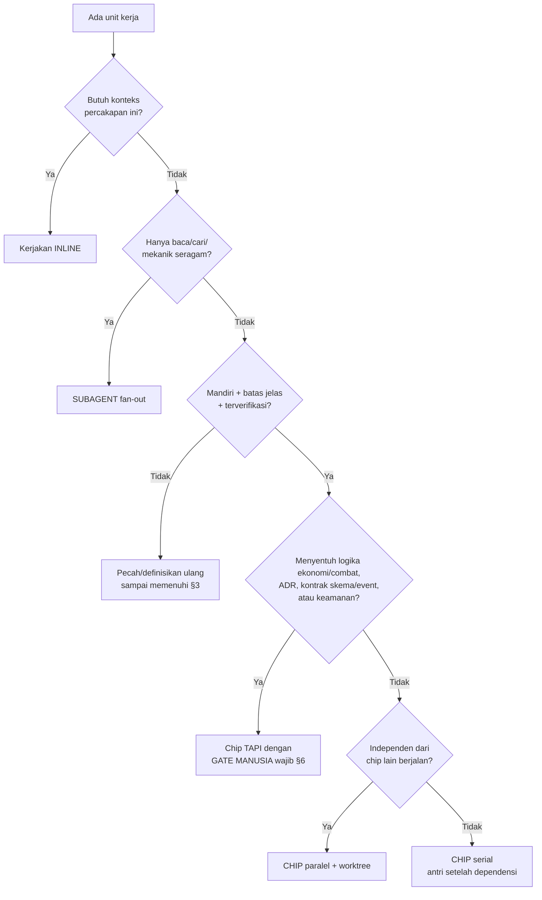
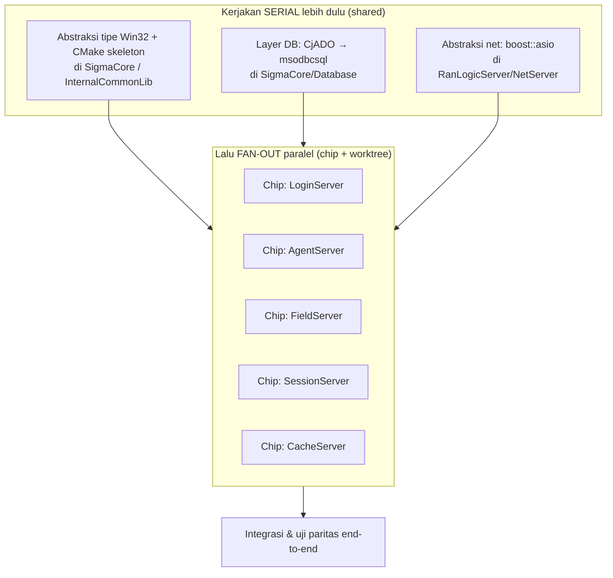

# Model Eksekusi & Dekomposisi Kerja untuk Tim AI-Agent

**Status**: Draft v1 · **Tanggal**: 2026-06-14 · **Pemilik**: Lead / Enterprise Architect

> **Premis**: tim pelaksana proyek ini adalah **AI agent (Claude Code / Antigravity AI)**, bukan tim engineer manusia. Peran manusia bergeser menjadi **arsitek, reviewer, dan pengambil keputusan**. Dokumen ini adalah panduan **kapan & bagaimana memecah pekerjaan menjadi "chip"** (unit kerja mandiri yang dieksekusi agen secara paralel/terisolasi) — sekaligus menjadikan Ran Online sebagai **testbed cara kerja masa depan**. Turunan langsung dari prinsip [A8 (AI-augmented delivery)](06_master_plan.md#23-prinsip-arsitektur-tambahan-untuk-delivery) & [A7 (everything-as-code & auditable)](06_master_plan.md#23-prinsip-arsitektur-tambahan-untuk-delivery).

---

## 1. Mengapa Proyek Ini Cocok Jadi Testbed

Ran Online adalah kasus ideal untuk menguji cara kerja "tim AI agent":

- **Modular & banyak unit independen** — 5 server inti + ~8 platform service + ratusan tool/lib. Banyak yang bisa dikerjakan paralel.
- **Mekanik berulang skala besar** — abstraksi tipe Win32, konversi `.vcproj`→CMake, audit SP per-DB: pekerjaan yang seragam dan mudah di-fan-out.
- **Ada batas kritis yang jelas** — logika ekonomi & combat *tidak boleh* berubah (paritas, [O1](06_master_plan.md#22-tujuan-bisnis--metrik-sukses)). Ini memaksa kita mendefinisikan **gate manusia** secara eksplisit — justru inti dari cara kerja AI-agent yang aman.
- **Auditability sudah jadi syarat** (POJK, A7) — tiap perubahan harus tertelusur. Model chip + PR + GitOps secara alami memenuhi ini.

**Pergeseran peran:**

| Dahulu (tim manusia) | Sekarang (tim AI-agent) |
| :--- | :--- |
| Engineer menulis kode | **Agen** menulis kode; manusia me-*review* |
| Lead membagi task ke orang | Lead/arsitek menulis **chip-spec**; orchestrator/agen mengeksekusi |
| Estimasi per sprint | Dekomposisi per **unit terverifikasi**; paralelisme dibatasi kopling, bukan headcount |
| QA manual | **Gate otomatis** (build/test/parity) + review manusia di titik kritis |

---

## 2. Mode Eksekusi di Claude Code (Taksonomi)

Tidak semua pekerjaan jadi "chip". Pilih mode sesuai sifat kerjanya:

| Mode | Apa | Kapan dipakai | Isolasi | Paralel? |
| :--- | :--- | :--- | :---: | :---: |
| **Inline** (sesi utama) | Dikerjakan langsung di percakapan | Kecil; butuh konteks sesi ini; dependen pada langkah sebelumnya | tidak | tidak |
| **Subagent** (Agent tool) | Agen ber-konteks sendiri, kembalikan kesimpulan | Fan-out riset/eksplorasi luas; pekerjaan mekanik seragam; delegasi terbatas | opsional (worktree) | ya |
| **Chip / background task** | Unit mandiri → **sesi + worktree sendiri**; manusia satu klik untuk menjalankan | Pekerjaan out-of-scope/paralel yang **berdiri sendiri** (cold-startable) | worktree | ya |
| **Worktree isolation** | Salinan repo terisolasi | Perubahan berisiko/eksperimental atau paralel yang tak boleh saling sentuh | worktree | ya |
| **Scheduled / Loop** | Eksekusi berulang/terjadwal | Babysit CI, polling deploy, tugas rutin | — | n/a |

> Aturan praktis: **inline** untuk yang butuh konteks hidup; **subagent** untuk *membaca/mencari/mekanik*; **chip** untuk *unit kerja mandiri yang bisa diparalelkan*; **scheduled** untuk *yang berulang*.

---

## 3. Anatomi Sebuah "Chip"

Sebuah chip layak dipecah hanya jika memenuhi **4 sifat**:

1. **Mandiri (cold-startable)** — bisa dijelaskan sehingga sesi baru *tanpa* konteks percakapan ini mampu mengeksekusinya. Sertakan path file & latar secukupnya.
2. **Berbatas (bounded)** — satu hasil koheren, lingkup jelas (apa yang masuk & **apa yang tidak**).
3. **Terverifikasi** — ada kriteria selesai objektif (build hijau, test lulus, output query, paritas).
4. **Aman diparalelkan** — tidak menulis file yang sama dengan chip lain yang jalan bersamaan.

**Template chip-spec** (harus berdiri sendiri):

```md
Judul: <verb + objek, mis. "Port LoginServer net loop ke boost::asio">
Konteks: <repo, file/dir terkait dengan path, dependensi yang sudah ada>
Lingkup IN: <yang dikerjakan>
Lingkup OUT: <yang TIDAK disentuh — cegah scope creep & tabrakan>
Kriteria selesai: <build/test/paritas/output yang membuktikan beres>
Verifikasi: <perintah konkret, mis. `cmake --build … && ctest`>
Branch/worktree: <isolasi>
Gate: <perlu review manusia? untuk apa?>
```

---

## 4. Rubrik Inti — KAPAN Memecah Jadi Chip



| Sinyal | Keputusan |
| :--- | :--- |
| Kecil, dependen, butuh konteks sesi | **Inline** |
| Sapu banyak file untuk *menyimpulkan* (riset/inventory) | **Subagent** |
| Mekanik seragam repo-wide (mis. ganti tipe Win32) | **Subagent fan-out** atau **chip per-modul** |
| Unit mandiri + independen + terverifikasi | **Chip paralel (worktree)** |
| Unit mandiri tapi bergantung output lain | **Chip serial** |
| Menyentuh ekonomi/combat/ADR/skema/keamanan | **Chip + gate manusia** (jangan fire-and-forget) |
| Belum mandiri/berbatas | **Jangan dipecah dulu** — perhalus spec |

---

## 5. Pola Paralelisasi pada Roadmap Ini (Contoh Konkret)

**Peta kopling dulu** — yang *shared* harus diselesaikan **serial** sebelum fan-out, karena banyak server bergantung padanya:



Contoh fan-out aman di proyek ini:

| Pekerjaan | Mode | Catatan |
| :--- | :--- | :--- |
| Audit SP per DB (8 `.bak`) | **8 chip / subagent paralel** | Tiap DB independen — lihat [runbook](runbooks/db-restore.md) |
| Ganti `DWORD`→`uint32_t` dkawasan luas | **Subagent fan-out** mekanik | Seragam, low-risk, mudah di-review |
| Konversi `.vcproj`→CMake per proyek | **Chip per modul** | Setelah skeleton CMake shared jadi |
| Porting tiap server inti | **Chip paralel** | **Hanya setelah** shared layer (A1–A3) beres |
| Tiap platform service Fase 3 (ledger, market, dst.) | **Chip per service** | Bounded context jelas; integrasi via event bus |
| Tuning indeks pasar / balancing combat | **Inline + gate manusia** | Sentuh ekonomi → bukan fire-and-forget |

> **Anti-pola**: mem-fan-out porting 5 server *sebelum* layer net/DB shared stabil → 5 chip menulis ulang abstraksi yang sama dan bertabrakan saat merge. Selesaikan tulang punggung dulu, baru sebar.

---

## 6. Gate Manusia (Non-Negotiable)

Agen **mengusulkan**, manusia **memutuskan** di titik berikut. Ini penjaga prinsip A8 & paritas O1:

| Gate | Mengapa | Bentuk |
| :--- | :--- | :--- |
| **Paritas ekonomi & combat** | Risiko regresi tertinggi; jiwa game | Review + suite uji paritas wajib lulus |
| **Keputusan arsitektur (ADR)** | Mengikat banyak chip turunan | ADR di-*review* & di-*Accept* manusia |
| **Kontrak skema & event** | Sumber kebenaran lintas-service | Disetujui sebelum implementasi paralel |
| **Keamanan & compliance (POJK)** | Data residency, least privilege, AML | Review wajib; tak boleh di-auto-merge |
| **Rilis ke produksi** | Dampak pemain nyata | Persetujuan + checklist deploy |

Selebihnya (porting mekanik, scaffolding, tooling, dokumentasi) boleh berjalan dengan review ringan/asinkron.

---

## 7. Guardrail Kualitas & Auditability

Tiap chip wajib:

1. Berjalan di **branch/worktree** sendiri (zero-drift, A7).
2. **Build + test hijau** sebelum diajukan; sentuh gameplay → **gate paritas**.
3. Berakhir sebagai **PR** yang di-*review* (manusia di titik kritis, ringan di lain tempat) lalu masuk via **GitOps**.
4. **Tertelusur**: chip-spec → PR → commit. Memenuhi jejak audit POJK secara alami (tiap perubahan punya "kenapa" dan "siapa/agen apa").

---

## 8. Tangga Kematangan Otonomi (Cara Kerja Masa Depan)

Naikkan otonomi secara bertahap seiring kepercayaan:

| Level | Cara kerja | Cocok untuk fase |
| :---: | :--- | :--- |
| **L0 — Supervised** | Manusia memandu tiap langkah inline | Spike awal, keputusan arsitektur |
| **L1 — Parallel-with-review** | Beberapa chip paralel; manusia review tiap PR | Fase 1–2 porting mekanik |
| **L2 — Orchestrated** | Satu *lead agent* mendekomposisi & mengirim sub-chip; manusia review di gate saja | Fase 3 platform services |
| **L3 — Scheduled/continuous** | Agen terjadwal/loop (babysit CI, audit rutin, perbaikan kecil) dengan gate otomatis | Fase 4–5 operasi |

Mulai dari **L0/L1** (spike DB & porting), naik ke **L2** saat shared layer stabil & kontrak jelas, dan **L3** untuk operasi berulang. Setiap kenaikan level **menambah otomatisasi, bukan mengurangi gate manusia** pada titik kritis (§6).

---

## 9. Literasi Model — Memilih Model & Effort per Chip

Efisiensi biaya delivery (prinsip [pilar 4](00_design_pillars.md), "OpEx rendah = kemerdekaan etis") **menyentuh pemilihan model** untuk tiap chip. Prinsip inti: **cocokkan kapabilitas model dengan kompleksitas & risiko chip — bukan "selalu pakai yang termahal".** Karena setiap chip punya *gate* objektif (build/test/paritas, §7), model murah **aman** untuk chip low-risk; model mahal disimpan untuk chip kritis & ber-*gate manusia* (§6).

> ⚠️ Lineup model bergerak cepat. Tabel di bawah akurat **per pertengahan 2026**; nama/harga bisa berubah. Verifikasi picker terkini sebelum mengeksekusi.

### 9.1 Sumbu keputusan
Dua sumbu menentukan pilihan: **(a) kompleksitas/risiko chip** dan **(b) effort/thinking level** (dalam-model). Naikkan *salah satu* sebelum naikkan keduanya — sering kali **model menengah + effort tinggi** mengalahkan **model atas + effort rendah** untuk tugas penalaran, dengan biaya lebih rendah.

### 9.2 Claude Code (keluarga Claude)

| Kelas chip | Model | Effort | Alasan |
| :--- | :--- | :--- | :--- |
| Riset/cari read-only, fan-out eksplorasi (subagent) | **Haiku 4.5** (`claude-haiku-4-5`) | `low` | Cepat & termurah ($1/$5 /1M); hasil = kesimpulan, mudah diverifikasi |
| Porting mekanik seragam (tipe Win32→`uint32_t`, `.vcproj`→CMake), scaffolding, dokumentasi | **Sonnet 4.6** (`claude-sonnet-4-6`) | `medium` | Keseimbangan kecepatan/kecerdasan terbaik ($3/$15); volume tinggi |
| Porting server inti, integrasi end-to-end, agentic panjang | **Opus 4.8** (`claude-opus-4-8`) | `high`/`xhigh` | Paling mampu long-horizon; `xhigh` = default coding Claude Code |
| Chip **ber-gate kritis**: paritas ekonomi/combat, ledger, ADR, keamanan/compliance | **Opus 4.8** atau **Fable 5** (`claude-fable-5`) | `xhigh`/`max` | Korektnes > biaya; jangan pernah pakai model murah/effort rendah di sini |

Effort Claude: `low < medium < high < xhigh < max`. Default Claude Code = `xhigh`; minimum `high` untuk kerja sensitif-kecerdasan; `low` untuk subagent/tugas sederhana.

### 9.3 Antigravity (keluarga Gemini)

| Kelas chip | Model | Thinking level | Alasan |
| :--- | :--- | :--- | :--- |
| Read/cari/mekanik ringan | **Gemini 3.x Flash-Lite / Flash** | `low`/`minimal` | Termurah; latensi rendah |
| Implementasi terbatas, build/test, agentic langkah-sedikit | **Gemini 3.5 Flash** | `medium` | ~$0.50/$3.00 /1M; kuat untuk coding (SWE-bench ~78%); default Antigravity = `medium` |
| Agentic kompleks, planning, long-horizon, high-safety | **Gemini 3.x Pro** (+ Deep Think) | `high` | Skor tertinggi, mode Deep Think, fitur agentic Pro-only |
| Chip **ber-gate kritis** | **Gemini 3.x Pro** (Deep Think) | `high` | Korektnes > biaya |

Picker Antigravity: Settings → Models, selektor `low/medium/high`. Gemini 3.5 Flash GA & bisa jadi model coding default.

### 9.4 Aturan lintas-platform (yang penting)
1. **Default ke tier menengah** (Sonnet 4.6 / Gemini Flash), bukan tier atas. Gate yang kuat (§7) membuat model murah aman untuk chip low-risk.
2. **Eskalasi untuk gate kritis (§6)**: ekonomi/combat, ADR, kontrak skema/event, keamanan → tier atas + effort `high`+. **Tidak boleh** model murah/effort rendah di jalur kritis.
3. **Fan-out murah, dalam mahal**: chip seragam low-risk (audit SP per-8-DB, abstraksi tipe repo-wide) = model murah + effort rendah × banyak paralel → throughput tinggi, biaya rendah. Chip kritis = model mahal, lebih sedikit, di-review manusia.
4. **Beri spec penuh di awal** (lihat template chip-spec §3): Opus 4.8 & Gemini Pro keduanya bekerja jauh lebih baik untuk long-horizon bila seluruh spesifikasi diberikan dalam satu giliran pada effort tinggi.
5. **Effort sebelum model**: untuk tugas penalaran, coba naikkan effort dulu sebelum lompat ke model lebih mahal.

---

## 10. Analisis Biaya Tim — dari Mandays ke Biaya Agen + Limit

Pergeseran inti: dahulu biaya tim = **mandays** (gaji × hari; paralelisme dibatasi *headcount*). Sekarang = **biaya model/agen + limit langganan**; paralelisme dibatasi **kuota token per window**, bukan jumlah orang. **Limit berperilaku seperti "waktu istirahat"**: saat kuota habis, agen menunggu reset (window 5-jam / cap mingguan) — analog pekerja yang harus istirahat. Bedanya, "istirahat" agen bisa **dibeli hilang** dengan membayar (tier lebih tinggi / API pay-per-token).

> ⚠️ Harga & limit di bawah **indikatif per pertengahan 2026** dan sering berubah; verifikasi sebelum menganggarkan.

### 10.1 Insight utama: bottleneck pindah dari biaya → throughput
Biaya token agen **sangat kecil** dibanding mandays. Contoh kasar: satu chip porting ≈ 2M input + 0,3M output token; di **Sonnet 4.6** ($3/$15 per 1M) dengan prompt-cache (read ~0,1×) ≈ **~$5/chip**. Lima server inti ≈ **~$25** — jauh di bawah satu *man-month*. → **Uang bukan lagi bottleneck; yang membatasi adalah throughput-under-limit (wall-clock).** Maka optimasi bergeser dari "minimalkan biaya" menjadi **"maksimalkan kerja per window sebelum istirahat"**.

### 10.2 Dua model penagihan

| Model | Biaya | "Istirahat" (limit) | Cocok untuk |
| :--- | :--- | :--- | :--- |
| **Langganan** (capped) | Tetap / bulan | **Ada** (window 5-jam + cap mingguan) | Kerja harian berkelanjutan; prediktabel |
| **Pay-per-token** (API) | Variabel, sesuai pakai | **Tidak ada** (hanya batas RPM/TPM per menit) | Burst / fan-out paralel besar; deadline ketat |

Langganan (indikatif, mid-2026):
- **Claude Code**: Pro $20 (1×) · Max 5× $100 · Max 20× $200/bln. Limit dua-lapis: window 5-jam + cap mingguan (Anthropic tak publikasi kuota token persis — hanya multiplier).
- **Antigravity (Google AI)**: Pro $20 (~5× request, refresh tiap 5 jam) · Ultra ~$250 (hapus cap mingguan). Sistem "compute-based".

API pay-per-token (per 1M, indikatif): Claude **Haiku 4.5** $1/$5 · **Sonnet 4.6** $3/$15 · **Opus 4.8** $5/$25 · **Fable 5** $10/$50. Gemini **Flash** ~$0,5/$3 · **Pro** ~$2,5/$15. Penghemat: prompt caching (read ~0,1×), Batch API (−50%).

### 10.3 "Limit = waktu istirahat": cara merencanakan timeline
- **Jadwalkan chip berat di awal window** (kuota penuh); chip ringan/murah saat kuota menipis.
- Saat kena cap, perlakukan sebagai **istirahat terjadwal**, bukan blocker — pakai jeda itu untuk **review manusia di gate (§6)** yang memang sequential.
- **Hapus istirahat = bayar**: untuk burst paralel besar (fan-out porting 5 server / audit 8 DB), lompat ke **API pay-per-token** (tanpa cap window) — beli throughput hanya saat deadline menuntut.
- **Tuas hemat utama = literasi model ([§9](#9-literasi-model--memilih-model--effort-per-chip))**: model murah + effort rendah meregangkan kuota window → lebih banyak chip selesai sebelum istirahat.

### 10.4 Aturan praktis
1. **Default**: 1–2 langganan tier atas (Max 20× / Ultra) untuk kerja harian — prediktabel; "rest" diterima → timeline lebih panjang tapi biaya rendah.
2. **Akselerasi**: tambahkan **API pay-per-token** saat butuh paralelisme besar tanpa rest — biaya naik, wall-clock turun.
3. **Konsisten dengan pilar 4**: total biaya bulanan tim AI-agent (langganan + sedikit API overflow) jauh di bawah mandays-equivalent satu engineer → menjaga **OpEx rendah = kemerdekaan etis**.

---

## 11. Referensi

- [`06_master_plan.md`](06_master_plan.md) — master plan; prinsip A7/A8 & roadmap Fase 0–5.
- [`runbooks/db-restore.md`](runbooks/db-restore.md) — contoh pekerjaan yang ideal di-fan-out (audit SP per-DB).
- [`00_design_pillars.md`](00_design_pillars.md) — north-star; "OpEx rendah = kemerdekaan etis" (efisiensi delivery termasuk di dalamnya).
