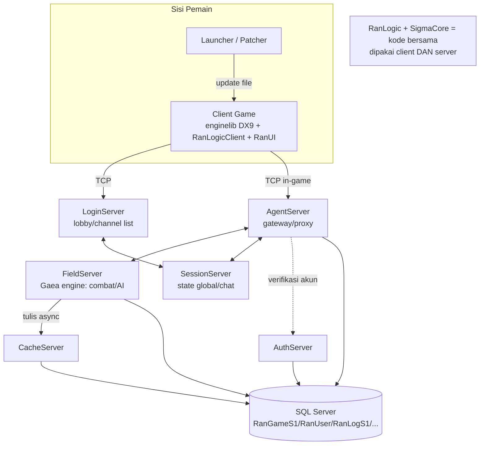

# 08 — Peta Source Tree Ran Online (Panduan Anti-Kuncen)

> **Tujuan**: peta lengkap & jujur atas seluruh source yang ada di disk — supaya **tidak ada pengetahuan yang tersandera satu orang/vendor** ("anti-kuncen"). Ini rujukan orientasi + handover: siapa pun (manusia atau agen AI) bisa paham *apa yang kita punya, apa yang sudah/belum di-port, dan kenapa keputusan strategis diambil*.
>
> Disusun 2026-06-16 setelah temuan: **repo ini berisi source LENGKAP** (client + server + engine + tools + launcher), bukan hanya server.

---

## 0. Fakta headline

- **~35.485 file** `.cpp/.c/.h` (di luar `ranserver-linux/`). Tree game komersial penuh ~20 tahun.
- **1 solution**: `Smtm_2008.sln` (codename **Smtm**), **129 project**, target VS2008.
- Ini **bukan cuma server** — ada **client game lengkap + engine DirectX 9 + semua tool editor + launcher/patcher**.
- **Batas git**: hanya `docs/` + `ranserver-linux/` yang di-track. **Semua sisanya local-only / gitignored** (lihat [§5](#5-implikasi-strategis-anti-kuncen--no-lock-in)).

---

## 1. Peta kategori (apa milik siapa)

### 🎮 Client (game yang dijalankan pemain)
| Project / Folder | Peran | Ukuran |
| :--- | :--- | :--- |
| `Ran Exe File` (grouping solution) | exe client utama | — |
| [`RanLogicClient`](file:///Users/mochammad.emir/Library/Mobile%20Documents/com~apple%20CloudDocs/Code/ran-online/RanLogicClient) | logika game sisi-client (combat view, inventory UI, dll.) | 512 file |
| [`enginelib`](file:///Users/mochammad.emir/Library/Mobile%20Documents/com~apple%20CloudDocs/Code/ran-online/enginelib) | **engine DirectX 9** (`DxCommon9`, render, mesh, anim) | 1.282 file |
| [`RanUI`](file:///Users/mochammad.emir/Library/Mobile%20Documents/com~apple%20CloudDocs/Code/ran-online/RanUI) / [`RanGfxUI`](file:///Users/mochammad.emir/Library/Mobile%20Documents/com~apple%20CloudDocs/Code/ran-online/RanGfxUI) / `RanHTML5UI` | UI in-game + HTML5 overlay | 1.330 / 69 file |
| `ScaleformLua` | UI Scaleform (Flash-based) | — |

> Engine = **DirectX 9 / MFC / Windows PC**. Untuk visi *mobile reborn*, client ini = **referensi**, bukan target build.

### 📦 Launcher / Patcher (distribusi ke pemain)
`AutoPatchMan`, `PatchPrimeMan` / `PatchPrimeManNew`, `PreDownloadMan`, `MinWebLauncher`, `RanOnlineInstaller`, `VersionManager` / `VersionMaker` / `VerMan`

### 🖥️ Server
| Project | Peran | Port (default port asli) |
| :--- | :--- | :--- |
| [`RanLogicServer`](file:///Users/mochammad.emir/Library/Mobile%20Documents/com~apple%20CloudDocs/Code/ran-online/RanLogicServer) | **inti logika semua server** (891 file) — kelas `CAuthServer`/`CLoginServer`/dst. | — |
| `AuthServer` | sertifikasi akun lintas-region | 9101 |
| `LoginServer` | lobby / direktori channel | 9200 |
| `AgentServer` | gateway client + proxy ke Field | 9301 |
| `SessionServer` | koordinator state global, chat relay | 9401 |
| `FieldServer` / `RanFieldServer` | engine gameplay (Gaea), combat/AI/peta | 9501 |
| `CacheServer` | tulis async data karakter ke DB | — |
| `InstanceServer` | dungeon / instance map | — |
| `MatchServer` | arena / matchmaking | — |
| `MoneyManager`, `RanStatistics`, `ServerController`, `ServerManager` | billing/ops/monitoring | — |

### 🔗 Shared (dipakai client **dan** server)
| Project | Peran |
| :--- | :--- |
| [`RanLogic`](file:///Users/mochammad.emir/Library/Mobile%20Documents/com~apple%20CloudDocs/Code/ran-online/RanLogic) | **protokol & tipe bersama** (625 file) — `s_NetGlobal.h` (enum `EMNET_MSG`), `Msg/*`, `Network/NetLogicDefine.h`, `Util/GlobalAuthManager` |
| [`SigmaCore`](file:///Users/mochammad.emir/Library/Mobile%20Documents/com~apple%20CloudDocs/Code/ran-online/SigmaCore) | **core lib** (243 file) — `Database/Ado` (CjADO), `Net`, `Encrypt/RC5`, `Hash`, `String` — **inilah yang kita port ke `ranserver-linux/`** |
| `SigmaCore2` | stub/penerus (2 file, hampir kosong) |
| `InternalCommonLib`, `MfcExLib` | util umum + ekstensi MFC |

### 🛠️ Tool editor (offline; bukan runtime client/server)
`CharEdit`/`GMCharEdit`, `LevelEdit`, `WorldEdit`, `QuestEdit`, `SkillEdit`, `ItemEdit`, `MobNpcEdit`, `UIEdit`, `RanOnlineEd`(RanEditor), `EffectTool`, `NpcAction`, `RandomOptionEdit`/`Tool`, `GenItemTool`, `ItemDataMergerTool`, `DataCheckTool`, `SpecialTool`, `Tool_VisualMaterial`/`VisualScript`/`UITexture`, `TextureTool`, `SoundSourceManager`, `CompareTool`, `CommentTool`, `HelpEdit`, `XmlConvert`, `kwxport`, `XSkinExp`

### 📚 Lib pihak-ketiga (vendored di root, prefix `=` atau folder sendiri)
`=CryptoPP` (RC5/MD5), `XLib_lzo` (**LZO, GPL** — lihat [§4](#4-implikasi-codecnet_compress)), `zlib`, `=cURL`, `=Freetype`, `Squirrel`/`=LuaPlus`/`ScaleformLua` (scripting), `=TBB`, `=GoogleProtocolBuffer`, `=MsgPack`, `Vorbislib`/`libogg`/FLAC/mad (audio), `=GeoIPLib`, `BugTrap`, `DirectShowLib`, `=DaumCrypt`, `StringEncrypt`/`TexEncrypt`

---

## 2. Bagaimana semuanya terhubung (runtime)

---

## 3. Apa yang sudah kita port vs belum

**Sudah** (di [`ranserver-linux/`](file:///Users/mochammad.emir/Library/Mobile%20Documents/com~apple%20CloudDocs/Code/ran-online/ranserver-linux), Linux): potongan **SigmaCore** (DB `OdbcDb`, Net `NetServer`, paket) + skeleton **5 server** + irisan vertikal (AuthServer cert, AgentServer login). Detail: [`docs/HANDOVER.md`](HANDOVER.md) + runbook di `docs/runbooks/`.

**Belum** (sengaja, sesuai aturan *serial shared-layer → fan-out → fitur*):
- Mayoritas handler pesan per-server (combat Gaea, inventory, party/guild, dll.).
- **Client** dan **engine** (DX9) — di luar scope server; visi = client mobile baru.
- Tool editor, launcher/patcher — tak relevan untuk runtime server.
- `CacheServer`, `InstanceServer`, `MatchServer` — server tambahan, fase berikut.

---

## 4. Implikasi codec/`NET_COMPRESS`

Paket `NET_COMPRESS` pakai **LZO** (`XLib_lzo`, lisensi **GPL v2+**, by Oberhumer). Karena **kita punya source client + engine penuh**, kita **tidak terkunci** ke client lama:

- LZO jadi *hard constraint* **hanya** untuk interop dengan **binary client lama yang sudah terdistribusi**.
- Saat client di-rebuild/di-port (mis. client mobile baru), kita **kendalikan codec** → bebas pakai **zstd/LZ4** (permissive) dan buang LZO.
- **Keputusan ditunda ke fase client.** Untuk sekarang **stick to as-is** (LZO server-side) — penggunaan server-side tak memicu kewajiban GPL selama binary server tak didistribusikan (LZO = GPL, **bukan** AGPL).

> **Open item** (belum ada runbook khusus LZO; chip C dari Antigravity hanya menambah `net/minlzo.cpp` + `lzo_smoke.cpp`): saat masuk fase client, putuskan **legacy-compat vs codec baru**, lalu pilih: (a) **zstd/LZ4** (BSD, kalau client baru), (b) **lzokay** (MIT clean-room LZO1X, kalau wajib legacy — perlu verifikasi lisensi/kematangan), atau (c) bikin sendiri (~1 minggu). Catatan tambahan: build `ran_lzo` saat ini menarik `../XLib_lzo` dari **luar** `ranserver-linux/` (gitignored) → langgar batas self-contained; vendor-kan ke dalam atau ganti codec saat keputusan diambil.

---

## 5. Implikasi strategis (anti-kuncen & no-lock-in)

1. **Pengetahuan tak tersandera**: peta ini + `docs/HANDOVER.md` membuat seluruh tree bisa di-handover ke siapa pun tanpa "kuncen". Sejalan prinsip **A2 (cloud-exit / minimalkan ketergantungan vendor-brand)** dan model tim-agen AI (`docs/07`).
2. **Batas git sengaja sempit**: hanya `docs/` + `ranserver-linux/` di-track. Sisanya (client, engine, tools, lib pihak-ketiga) **local-only & gitignored** — karena:
   - **Proprietary**: source game asli + Scaleform + DaumCrypt, dll.
   - **Lisensi campur**: GPL (LZO), CryptoPP, codec audio — **tak bisa di-publik begitu saja**.
   - Yang *boleh* publik kalau suatu hari open-source = **hanya hasil port kita** (`ranserver-linux/`) + docs.
3. **Aset referensi, bukan beban**: client/engine/tool lama = **sumber kebenaran** saat porting (verifikasi protokol, kripto, format) — seperti yang dipakai untuk mengoreksi key RC5 & nama DB. Bukan untuk dibangun ulang apa adanya.

---

## 6. Rujukan handover
- [`docs/HANDOVER.md`](HANDOVER.md) — status & cara build/verify (paling penting untuk penerus)
- [`docs/06_master_plan.md`](06_master_plan.md) — payung arsitektur & roadmap
- [`docs/07_ai_delivery_operating_model.md`](07_ai_delivery_operating_model.md) — model tim-agen AI, aturan chip & serial→fan-out
- [`docs/02_server_components/`](02_server_components) — peran tiap server
- `docs/runbooks/` — jejak tiap chip port (DB, net, paket, cert, fan-out)

> Aturan emas saat porting: **verifikasi tiap konstanta/format ke source asli di tree ini** (jangan menebak). Source ada — pakai. Itu inti anti-kuncen: keputusan berbasis bukti yang bisa ditelusuri siapa pun.
