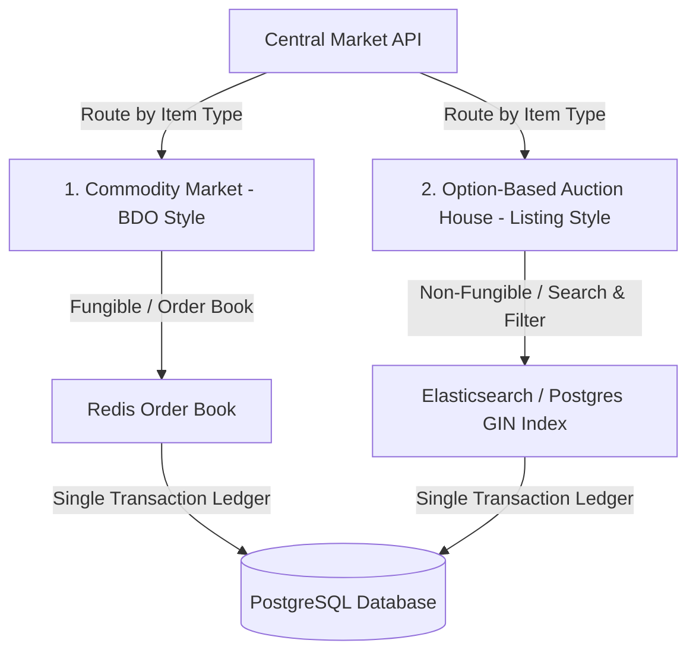

# Desain Konseptual: Central Market & Penanganan Random Options

Dokumen ini mendokumentasikan visi masa depan (*future enhancement*) untuk menggantikan sistem Vending tradisional (Private Market) di Ran Online dengan sistem **Central Market** terpusat, dengan fokus khusus pada penanganan fitur unik Ran Online: **Random Options / Random Rates** (di mana setiap item memiliki stat acak unik).

---

## 1. Tantangan Arsitektur: Fungible vs. Non-Fungible Items

Dalam game *Black Desert Online* (BDO), barang dagangan bersifat **Fungible** (saling menggantikan). Dua pedang "PEN Blackstar Greatsword" memiliki stat yang identik, sehingga bisa digabungkan ke dalam satu buku pesanan (*Single Order Book*) seperti saham perusahaan.

Di Ran Online, sistem **Random Option** (seperti yang terlihat pada logika penyunting [RandomOptionEdit](file:///Users/mochammad.emir/Library/Mobile%20Documents/com~apple%20CloudDocs/Code/ran-online/RandomOptionEdit)) membuat item bersifat **Non-Fungible** (seperti NFT). Dua buah "Titanium Sword" yang sama bisa memiliki statistik yang sangat berbeda:
* **Item A**: Titanium Sword [+10.4% Attack Rate, +3.1% Critical]
* **Item B**: Titanium Sword [+5.2% Evasion Rate, +150 HP]

Pemain tidak akan mau membeli "Titanium Sword" secara acak tanpa melihat statistik uniknya. Oleh karena itu, *Matching Engine* bursa saham murni tidak bisa diterapkan secara mentah-mentah untuk semua barang.

---

## 2. Solusi Arsitektur: Hybrid Marketplace Model

Untuk mengakomodasi keunikan Ran Online, kita mengusulkan arsitektur **Hybrid Marketplace**:



### A. Commodity Market (BDO-Style Order Book)
Digunakan untuk barang-barang **Fungible** yang tidak memiliki Random Option:
* **Komoditas**: Ramuan (*Potions*), kartu *remodel*, tiket peta, bahan pembuatan barang (*crafting materials*), dan perlengkapan bersih (*clean gear* tanpa opsi).
* **Mekanisme**: Pencocokan antrean otomatis (*Matching Engine*) berdasarkan harga penawaran beli/jual terbaik dengan fluktuasi harga dinamis.

### B. Option-Based Auction House (Listing-Style dengan Pencarian Stat)
Digunakan untuk perlengkapan **Non-Fungible** yang memiliki Random Option (Senjata, Pelindung, Aksesoris):
* **Mekanisme**: Penjual mendaftarkan item beserta data biner opsi uniknya (Tipe Opsi, Nilai Opsi, Tingkat Persentase).
* **Fitur Pencarian (Search & Filter)**: Menggunakan indeks teks/JSON di database (PostgreSQL GIN Index atau Elasticsearch) agar pembeli bisa melakukan filter pencarian yang presisi, misalnya:
  * *"Cari Titanium Sword dengan minimal opsi [Attack Rate >= 8%]"*.
* **Eksekusi**: Pembeli memilih item spesifik dari daftar hasil pencarian, dan transaksi diselesaikan melalui API dompet pasar (*Market Wallet*).

---

## 3. Struktur Data Item dengan Random Option di Database

Untuk mendukung pencarian stat yang cepat di database PostgreSQL, struktur penyimpanan item diatur menggunakan format JSONB dengan pengindeksan GIN:

```sql
CREATE TABLE market_listings (
    listing_id SERIAL PRIMARY KEY,
    seller_char_id INT NOT NULL,
    item_id INT NOT NULL,
    base_name VARCHAR(100) NOT NULL,
    price BIGINT NOT NULL,
    -- Menyimpan opsi acak secara terstruktur
    random_options JSONB NOT NULL, 
    created_at TIMESTAMP DEFAULT CURRENT_TIMESTAMP
);

-- Contoh Data JSONB untuk random_options:
-- [
--   {"type": "ATTACK_RATE", "value": 10.4},
--   {"type": "CRITICAL", "value": 3.1}
-- ]

-- Membuat GIN Index untuk pencarian stat super cepat:
CREATE INDEX idx_market_listings_options ON market_listings USING gin (random_options);
```

Dengan indeks GIN ini, query pencarian untuk item dengan opsi tertentu seperti:
```sql
SELECT * FROM market_listings 
WHERE base_name = 'Titanium Sword' 
  AND random_options @> '[{"type": "ATTACK_RATE"}]'
  AND (random_options->0->>'value')::float >= 8.0;
```
Akan dieksekusi dalam beberapa milidetik saja, menjamin latensi super rendah bagi ribuan pemain yang sedang mencari perlengkapan terbaik.

---

## 4. Keuntungan Desain Hybrid

1. **Mempertahankan Ciri Khas Game**:
   Identitas unik Ran Online (berburu barang dengan "perfect random rate") tetap terjaga penuh.
2. **Kemudahan Menilai Barang (Market Valuation)**:
   Sistem dapat menghitung rata-rata harga pasar berdasarkan kemiripan statistik. Pemain bisa melihat statistik harga riwayat untuk Titanium Sword dengan opsi sejenis, mengurangi penipuan harga (*scamming*).
3. **Optimasi Infrastruktur**:
   Data item ber-opsi kompleks dipisahkan secara logis dari *Matching Engine* komoditas yang super cepat, menjaga throughput sistem API tetap tinggi.
