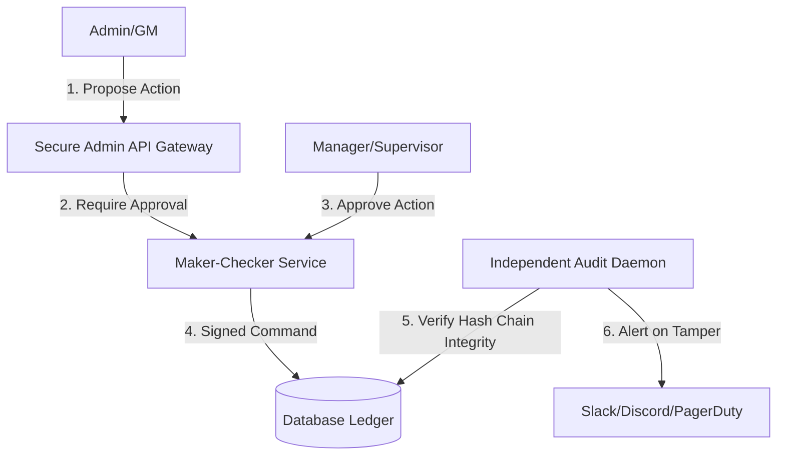

# Kebijakan Keamanan: Mitigasi Fraud Internal (Anti-Inside Threat)

Dokumen ini mendokumentasikan visi masa depan (*future enhancement*) untuk mencegah kecurangan internal oleh staf resmi (*rogue administrators/developers*), seperti pengeditan item ilegal (*unauthorized item edit*) atau injeksi emas (*gold injecting*) untuk kebutuhan perdagangan uang riil (RMT - Real Money Trading).

---

## 1. Problem Statement: Ancaman dari Dalam (Inside Threat)

Pada pengelolaan game online, celah keamanan terbesar sering kali bukan berasal dari peretas luar, melainkan dari staf internal yang memiliki hak akses administrator. Kasus umum meliputi:
* Penggunaan alat seperti [CharEdit](file:///Users/mochammad.emir/Library/Mobile%20Documents/com~apple%20CloudDocs/Code/ran-online/CharEdit) atau [GMCharEdit](file:///Users/mochammad.emir/Library/Mobile%20Documents/com~apple%20CloudDocs/Code/ran-online/GMCharEdit) untuk mengubah stat karakter secara ilegal.
* Menjalankan query SQL langsung di database untuk menyuntikkan item langka (*spawning items*) atau emas (*gold*) ke akun dummy untuk dijual di pasar gelap RMT.
* Penghapusan log audit di database untuk menghilangkan jejak aksi ilegal.

Untuk mengatasinya, kita mengadaptasi standar keamanan perbankan (**ISO 27001** & **COBIT**) ke dalam sistem administrasi game.

---

## 2. Pilar Keamanan Anti-Fraud Internal

### A. Prinsip Maker-Checker (Four-Eyes Principle / Otorisasi Ganda)
GM atau Stator tidak boleh memiliki hak untuk mengeksekusi perintah sensitif secara sepihak. Setiap tindakan administratif kritis wajib melalui alur otorisasi ganda:
* **Maker (Pembuat)**: Staf mengajukan permohonan (misal: "Kompensasi item X untuk Pemain A karena kendala sistem").
* **Checker (Pemeriksa)**: Manajer atau supervisor harus meninjau dan menyetujui permintaan tersebut melalui dasbor terpisah.
* **Tindakan Kritis yang Wajib Maker-Checker**:
  - Injeksi emas (*gold*) melebihi limit tertentu (misal: > 50,000,000 Gold).
  - Spawning item dengan tingkat kelangkaan tinggi (Grade S / Legendary).
  - Pemulihan (*restore*) karakter yang terhapus.

### B. Immutable Cryptographic Hash Chain (Rantai Audit Anti-Tamper)
Untuk mencegah staf IT yang memiliki akses langsung ke database (DBA) mengubah data melalui query SQL mentah:
* Setiap baris log administratif dan mutasi ekonomi dirantai menggunakan fungsi hash kriptografi SHA-256:
  $$H_i = \text{SHA256}(H_{i-1} \parallel \text{Data Transaksi}_i)$$
* **Audit Daemon Independen**: Sebuah aplikasi kecil yang berjalan terisolasi di cloud dengan hak akses *read-only* akan memverifikasi integritas rantai hash ini setiap jam. Jika ada baris data yang dimodifikasi tanpa melalui jalur resmi, rantai hash akan rusak dan daemon akan segera mengirimkan alarm keamanan (*tampering alert*) ke tim manajemen.

### C. Tanda Tangan Kriptografi Item (Cryptographic Item Signing)
Mencegah injeksi item mentah langsung ke database tanpa sepengetahuan engine game:
* Setiap kali item dibuat secara sah oleh game engine (seperti dijatuhkan oleh monster atau hasil crafting), game server menandatangani GUID item tersebut menggunakan **kunci privat (*private key*)** yang hanya disimpan di memori *Gaea Server*.
* Saat pemain mencoba menggunakan, memakai, atau memperdagangkan item tersebut, Field Server akan memverifikasi tanda tangan digitalnya menggunakan kunci publik.
* Jika tanda tangan tidak cocok (indikasi item disuntik langsung ke database menggunakan query SQL oleh staf nakal), item tersebut akan otomatis disita, dan karakter yang memegangnya akan dikunci secara otomatis oleh sistem keamanan (*auto-ban*).

### D. Pengerasan Akses Database (Database Hardening)
* Menghapus semua akses langsung (seperti koneksi SQL Server Management Studio / pgAdmin) ke database produksi. Akses database hanya diperbolehkan melalui **Bastion Host** dengan Multi-Factor Authentication (MFA) dan rekaman sesi (*session recording*).
* C++ Server terkoneksi menggunakan kredensial database dengan hak akses terbatas (*least privilege*), hanya boleh mengeksekusi stored procedure tertentu dan tidak memiliki hak akses perintah DDL (`DROP`, `ALTER`) atau `UPDATE` bebas pada tabel inventaris karakter.
