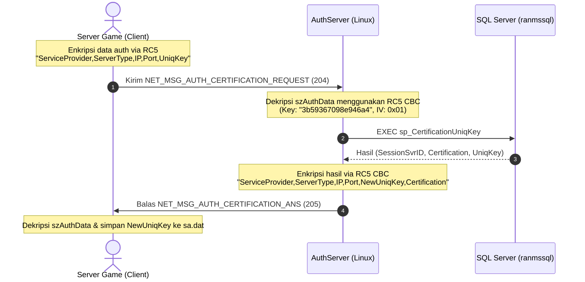

# Runbook — Full Certification Flow & Crypto (Chip B)

> **Tujuan**: Mengimplementasikan proses sertifikasi penuh (`NET_MSG_AUTH_CERTIFICATION_REQUEST` → `NET_MSG_AUTH_CERTIFICATION_ANS`) pada `AuthServer` dengan validasi kredensial biner nyata serta algoritma kriptografi RC5 CBC tantangan-jawaban (challenge-response).

---

## Alur Logika Sertifikasi



---

## Mekanisme Kriptografi RC5 CBC Standalone

Karena ketidakcocokan kompilasi pustaka legacy Crypto++ 5.4 pada GCC modern di Linux (C++17), kami mengimplementasikan engine RC5-32/16/16 secara mandiri di [auth_crypto.cpp](file:///Users/mochammad.emir/Library/Mobile%20Documents/com~apple%20CloudDocs/Code/ran-online/ranserver-linux/servers/authserver/auth_crypto.cpp).

* **Password**: `"mincoms"`
* **MD5 key**: `"3b59367098e946a4"` (16-byte pertama dari MD5 hex string `"3b59367098e946a489115f5d601b38f8"`).
* **IV**: `0x01` 8-byte (`01 01 01 01 01 01 01 01`).
* **Padding**: Standard PKCS#7 (blok kelipatan 8 byte).

---

## Definisi Paket Biner Nyata

Struktur biner dideklarasikan secara presisi pada [auth_server_msg.h](file:///Users/mochammad.emir/Library/Mobile%20Documents/com~apple%20CloudDocs/Code/ran-online/ranserver-linux/servers/authserver/auth_server_msg.h):

```cpp
struct G_AUTH_INFO {
    int  ServerType;
    int  nCounrtyType;
    char szServerIP[21];
    char pad1[3];
    int  nServicePort;
    int  nSessionSvrID;
    char szServerName[51];
    char szAuthData[501];
    char pad2[3];
};

struct NET_AUTH_CERTIFICATION_REQUEST {
    uint32_t    dwSize; // 600 bytes
    uint32_t    nType;  // 204
    G_AUTH_INFO gsi;
};

struct NET_AUTH_CERTIFICATION_ANS {
    uint32_t    dwSize; // 600 bytes
    uint32_t    nType;  // 205
    G_AUTH_INFO gsi;
};
```

---

## Hubungan Sumber Kode Legacy

* Logika pemrosesan asli Windows: [AuthServerMsgEx.cpp](file:///Users/mochammad.emir/Library/Mobile%20Documents/com~apple%20CloudDocs/Code/ran-online/RanLogicServer/Server/AuthServerMsgEx.cpp#L14)
* Logika sertifikasi client: [GlobalAuthClientLogic.cpp](file:///Users/mochammad.emir/Library/Mobile%20Documents/com~apple%20CloudDocs/Code/ran-online/RanLogic/Util/GlobalAuthClientLogic.cpp#L18)
* Logika sertifikasi server: [GlobalAuthServerLogic.cpp](file:///Users/mochammad.emir/Library/Mobile%20Documents/com~apple%20CloudDocs/Code/ran-online/RanLogic/Util/GlobalAuthServerLogic.cpp#L15)

---

## Langkah Verifikasi

Kompilasi dan jalankan smoke test pada container `ranlinux-dev`:

```bash
docker run --rm --platform linux/amd64 --network rannet \
  -v "$PWD":/src -e SA_PASSWORD="RanOnline@Spike0" -e DB_SERVER="ranmssql,1433" -e DB_NAME="RanUser" \
  ranlinux-dev bash -lc 'INC="-I/src/ranserver-linux/net -I/src/ranserver-linux/db -I/src/ranserver-linux/servers/authserver -I/src/ranserver-linux/platform -I/src/XLib_lzo/include"; COMMON="/src/ranserver-linux/net/net_server.cpp /src/ranserver-linux/net/packet.cpp /src/ranserver-linux/net/session.cpp /src/ranserver-linux/net/minlzo.cpp /src/ranserver-linux/net/send_msg_buffer.cpp /src/ranserver-linux/db/odbc_db.cpp /src/ranserver-linux/servers/authserver/auth_crypto.cpp"; LZO_FILES="/src/XLib_lzo/src/lzo_init.c /src/XLib_lzo/src/lzo1x_1.c /src/XLib_lzo/src/lzo1x_d2.c"; g++ -std=c++17 -Wall -Wextra -fwrapv $COMMON $LZO_FILES /src/ranserver-linux/servers/authserver/auth_server.cpp /src/ranserver-linux/servers/authserver/authserver_smoke.cpp $INC -lodbc -lpthread -o /tmp/authserver_smoke && /tmp/authserver_smoke'
```
Assertion memvalidasi kesuksesan dekripsi/enkripsi request & answer biner serta output sproc.
